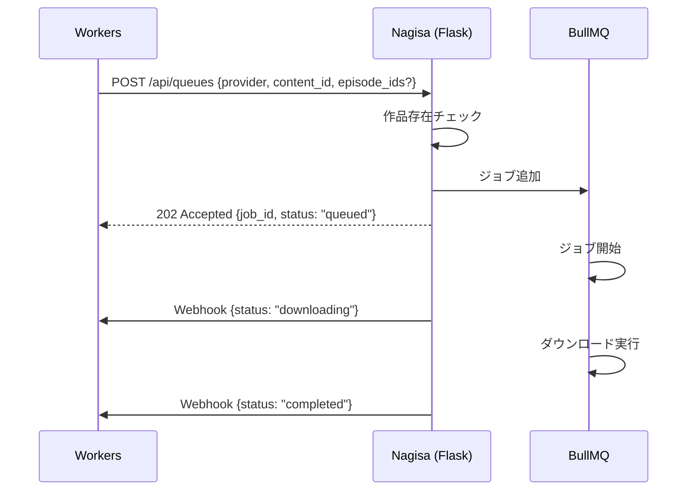

# Nagisa 側実装指示書

## このドキュメントについて

これは Nagisa（Flask + BullMQ ベースのダウンロードバックエンド）に対する仕様変更と実装タスクの指示書です。
呼び出し元である Cloudflare Workers（Hono）側の設計ドキュメント `recording-design.md` に基づいています。

変更は Phase A → B → C の順に依存関係があります。各 Phase の Workers 側の実装と並行して進めることができます。

> **注記 (2026-09-23)**: Phase A〜C は nagisa 側で実装済み (`nagisa/server/webhook.py`, `tasks/common.py`)。
> ただし当初の指示にあった環境変数名 `WORKERS_URL` は実装では **`TRACKER_URL`** になっているため、
> このドキュメント中の記述を訂正済みです。
>
> **Phase B (Webhook) は廃止しました。** 本番 nagisa コンテナの `printenv` に
> `TRACKER_URL` / `CF_ACCESS_CLIENT_ID` / `CF_ACCESS_CLIENT_SECRET` がいずれも無く
> (`compose.yaml` に `environment:` ブロック自体が無い)、`send_webhook` は
> `if not webhook_enabled(): return` で**ログも出さず**終了するため、この webhook は
> 実装以来 1 件も送信されていません。環境変数を足して復活させるのではなく、
> Workers → nagisa は既に Cloudflare Access の Service Auth で繋がっているので、
> **逆向きの経路を作らず pull 一方向に統一**します。以下 Phase B の節は撤去対象の参照用です。
>
> **Phase A (非同期化) と Phase C (エピソード単位指定) は引き続き有効**です。
> 特に Phase A の 202 レスポンスに含まれる `job_id` は、新方式で Workers 側が
> `Episode.recordJobId` として保存し、キュースナップショットとの突合に使う中心的な値になります。
>
> 新しい設計:
> - Workers 側: [`recording-sync.md`](./recording-sync.md)
> - nagisa 側の要求仕様: [`nagisa-library-api.md`](./nagisa-library-api.md)

---

## 背景と全体像

現在 Workers → Nagisa の連携は `POST /api/queues` 一本で、Nagisa はダウンロード完了まで同期的にレスポンスを返しています。これを以下のように変更します:

1. **非同期化**: Nagisa はジョブをキューに入れた時点で即座にレスポンスを返す
2. **Webhook 通知**: ジョブの状態変化時に Workers へ POST で通知する
3. **エピソード単位対応**: 作品全体だけでなく、指定エピソードのみダウンロードできるようにする



---

## Phase A: `POST /api/queues` の非同期化

### 現状の挙動

```
POST /api/queues
  → 作品存在チェック
  → ダウンロード実行（同期、長時間ブロック）
  → レスポンス返却
```

### 変更後の挙動

```
POST /api/queues
  → 作品存在チェック
  → BullMQ にジョブを追加
  → 即座にレスポンス返却（ダウンロードはバックグラウンド）
```

### リクエスト仕様（変更なし）

```json
POST /api/queues
Content-Type: application/json
CF-Access-Client-Id: <既存の認証>
CF-Access-Client-Secret: <既存の認証>

{
  "provider": "hulu" | "amazon",
  "content_id": "string"
}
```

### レスポンス仕様（変更あり）

#### 成功: ジョブがキューに入った

```
HTTP 202 Accepted
```

```json
{
  "job_id": "BullMQ のジョブID",
  "status": "queued"
}
```

- 現在は 200 を返しているが、**202 Accepted** に変更する
- `job_id` は BullMQ が発行するジョブの一意識別子をそのまま返す

#### エラー: 作品が見つからない

```
HTTP 404 Not Found
```

```json
{
  "error": "Content not found",
  "content_id": "xxx"
}
```

#### エラー: その他

```
HTTP 500 Internal Server Error
```

```json
{
  "error": "エラーメッセージ"
}
```

### 実装のポイント

- 既存のダウンロード処理ロジックはそのまま維持し、BullMQ のワーカーとして実行されるようにする
- `POST /api/queues` のハンドラは BullMQ の `queue.add()` を呼んでジョブIDを受け取り、即座に 202 を返す
- ダウンロード処理自体は BullMQ のワーカープロセス（`Worker` クラス）で非同期に実行する
- 既に BullMQ を使っている場合は、ハンドラ内で直接ダウンロードを呼んでいる箇所をキュー経由に変えるだけ

---

## Phase B: Webhook によるステータス通知 (廃止)

> **廃止 (2026-09-23)**: 以下は実装済みだが本番では一度も動いていない。撤去対象。
> 代替は `nagisa-library-api.md` の R5 (`GET /api/queue/snapshot`) と R1〜R3 (ライブラリ API)。

### 概要

BullMQ のジョブ状態が変化したタイミングで、Workers のエンドポイントに HTTP POST を送信する。

### Webhook 送信先

```
POST https://anime-tracker.tkgstrator.work/api/webhooks/record-status
```

> URL は Workers のデプロイ先に応じて環境変数で管理すること。

### 認証

**Cloudflare Access サービストークン方式**を使用する。Workers → Nagisa と同じ CF-Access の仕組みを逆方向にも適用する。

```
CF-Access-Client-Id: <サービストークンのClient ID>
CF-Access-Client-Secret: <サービストークンのClient Secret>
```

- Cloudflare Access ダッシュボードで Nagisa 用のサービストークンを発行する
- Workers 側の CF-Access ポリシーでこのサービストークンを許可する
- Nagisa 側では発行されたトークンの Client ID / Client Secret を環境変数で管理する
- Workers 側で独自の認証コードを書く必要がない（CF-Access が Workers の前段で検証する）

### リクエスト仕様

```json
POST /api/webhooks/record-status
Content-Type: application/json
CF-Access-Client-Id: <CLIENT_ID>
CF-Access-Client-Secret: <CLIENT_SECRET>

{
  "provider": "hulu" | "amazon",
  "content_id": "string",
  "episode_ids": ["string", ...],
  "status": "downloading" | "completed" | "failed",
  "error": "string (optional, failed時のみ)"
}
```

#### フィールド説明

| フィールド | 型 | 必須 | 説明 |
|-----------|-----|------|------|
| `provider` | string | Yes | `"hulu"` or `"amazon"` — ジョブ投入時に受け取った値をそのまま返す |
| `content_id` | string | Yes | ジョブ投入時に受け取った値をそのまま返す |
| `episode_ids` | string[] | Yes | ダウンロード対象のエピソードID。作品全体の場合は全エピソードのIDを列挙する。Phase C で `episode_ids` を受け取るようになった後はその値をそのまま返す。現時点では空配列 `[]` でよい |
| `status` | string | Yes | `"downloading"`: ジョブ処理開始、`"completed"`: ダウンロード成功、`"failed"`: ダウンロード失敗 |
| `error` | string | No | `status` が `"failed"` の場合のみ。エラーメッセージまたはスタックトレースの先頭 |

### 送信タイミング

BullMQ のイベントリスナーを使って以下の 3 つのタイミングで送信する:

| BullMQ イベント | 送信する `status` | タイミング |
|----------------|-------------------|-----------|
| `active` (ジョブ処理開始) | `"downloading"` | ワーカーがジョブを取り出して処理を開始した時 |
| `completed` (ジョブ成功) | `"completed"` | ダウンロードが正常に完了した時 |
| `failed` (ジョブ失敗) | `"failed"` | ダウンロードが失敗した時（リトライ上限到達後） |

### 実装例（Python）

```python
import requests
import os

TRACKER_URL = os.environ["TRACKER_URL"]  # e.g. "https://anime-tracker.tkgstrator.work"
CF_ACCESS_CLIENT_ID = os.environ["CF_ACCESS_CLIENT_ID"]
CF_ACCESS_CLIENT_SECRET = os.environ["CF_ACCESS_CLIENT_SECRET"]

def send_webhook(job_data: dict, status: str, error: str | None = None):
    """Workers にジョブステータスを通知する"""
    payload = {
        "provider": job_data["provider"],
        "content_id": job_data["content_id"],
        "episode_ids": job_data.get("episode_ids", []),
        "status": status,
    }
    if error is not None:
        payload["error"] = error

    try:
        resp = requests.post(
            f"{TRACKER_URL}/api/webhooks/record-status",
            json=payload,
            headers={
                "Content-Type": "application/json",
                "CF-Access-Client-Id": CF_ACCESS_CLIENT_ID,
                "CF-Access-Client-Secret": CF_ACCESS_CLIENT_SECRET,
            },
            timeout=10,
        )
        resp.raise_for_status()
    except requests.RequestException as e:
        # Webhook 送信失敗はログに記録するが、ダウンロード処理自体は止めない
        print(f"Webhook send failed: {e}")
```

```python
# BullMQ のイベントリスナー登録

# ジョブ処理開始時
def on_active(job, prev):
    send_webhook(job.data, "downloading")

# ジョブ完了時
def on_completed(job, result):
    send_webhook(job.data, "completed")

# ジョブ失敗時
def on_failed(job, error):
    send_webhook(job.data, "failed", error=str(error))
```

### 注意事項

- **Webhook 送信失敗はダウンロード処理をブロックしない**: Webhook が失敗してもダウンロード自体は継続する。Workers 側は次回画面表示時に状態を確認できる
- **リトライ不要**: Webhook 送信のリトライは不要。Workers 側はステータスが届かない場合でも正常に動作する（`queued` のまま表示される）
- **タイムアウト**: Webhook 送信の HTTP タイムアウトは 10 秒程度に設定する

---

## Phase C: エピソード単位のダウンロード対応

### 概要

現在の `POST /api/queues` は `content_id`（作品単位）でダウンロード指示を受けるが、特定のエピソードのみダウンロードする機能を追加する。

### リクエスト仕様（拡張）

```json
POST /api/queues
Content-Type: application/json

{
  "provider": "hulu" | "amazon",
  "content_id": "string",
  "episode_ids": ["string", ...]  // 新規追加（オプショナル）
}
```

#### `episode_ids` の仕様

| 条件 | 挙動 |
|------|------|
| `episode_ids` が省略 or 空配列 | 従来通り作品全体をダウンロード（後方互換） |
| `episode_ids` が指定されている | 指定されたエピソードのみダウンロード |

- `episode_ids` の値はプロバイダ側のエピソード識別子（Hulu の episodeId、Amazon の episodeId 等）
- Workers 側が DB からプロバイダ側の ID を解決して送信するため、Nagisa 側で ID の変換は不要

### レスポンス仕様

Phase A と同じ 202 レスポンス。変更なし。

### BullMQ ジョブデータ

ジョブの `data` に `episode_ids` を含めて保存する。これにより Webhook 送信時にそのまま `episode_ids` を返せる。

```python
# ジョブ追加時
job = await queue.add("download", {
    "provider": provider,
    "content_id": content_id,
    "episode_ids": episode_ids or [],  # 空配列 = 全エピソード
})
```

### ダウンロード処理の変更

- `episode_ids` が空の場合: 既存の作品全体ダウンロードロジックをそのまま使う
- `episode_ids` が指定されている場合: 該当エピソードのみをダウンロード対象にフィルタする

具体的なフィルタロジックは Nagisa 側の既存のダウンロード処理の構造に依存するため、実装時に判断してください。

---

## 環境変数まとめ

> **廃止 (2026-09-23)**: Phase B の廃止に伴い、以下の 3 変数は**追加しない**。
> nagisa は Workers の URL も資格情報も知らなくてよい。

~~Phase B で以下の環境変数を追加する:~~

| 変数名 | 説明 | 例 |
|--------|------|-----|
| `TRACKER_URL` | Workers のベース URL（Webhook 送信先） | `https://anime-tracker.tkgstrator.work` |
| `CF_ACCESS_CLIENT_ID` | CF-Access サービストークンの Client ID | Cloudflare ダッシュボードで発行 |
| `CF_ACCESS_CLIENT_SECRET` | CF-Access サービストークンの Client Secret | Cloudflare ダッシュボードで発行 |

---

## チェックリスト

### Phase A: 非同期化
- [ ] `POST /api/queues` のハンドラがダウンロードを同期実行している箇所を特定する
- [ ] BullMQ の `queue.add()` でジョブを追加し、即座に 202 + `{job_id, status}` を返すように変更する
- [ ] ダウンロード処理が BullMQ のワーカーでバックグラウンド実行されることを確認する
- [ ] 作品が見つからない場合に 404 を返すことを確認する

### Phase B: Webhook (廃止 — 撤去作業に読み替え)
- [x] ~~環境変数 `TRACKER_URL`、`CF_ACCESS_CLIENT_ID`、`CF_ACCESS_CLIENT_SECRET` を追加する~~ → **追加しない**
- [ ] `nagisa/server/webhook.py` を削除する (エラーコード定数は `errors.py` へ移す)
- [ ] `tasks/common.py` の `notify_start` / `notify_complete` 呼び出しを削除する
- [ ] Workers 側の `POST /api/webhooks/record-status` を削除する

### Phase C: エピソード単位
- [ ] `POST /api/queues` のリクエストボディで `episode_ids`（オプショナル配列）を受け取れるようにする
- [ ] `episode_ids` が省略/空の場合は従来通り作品全体をダウンロードすることを確認する（後方互換）
- [ ] `episode_ids` が指定されている場合、該当エピソードのみダウンロードすることを確認する
- [ ] BullMQ ジョブデータに `episode_ids` を含め、Webhook で正しく返されることを確認する
