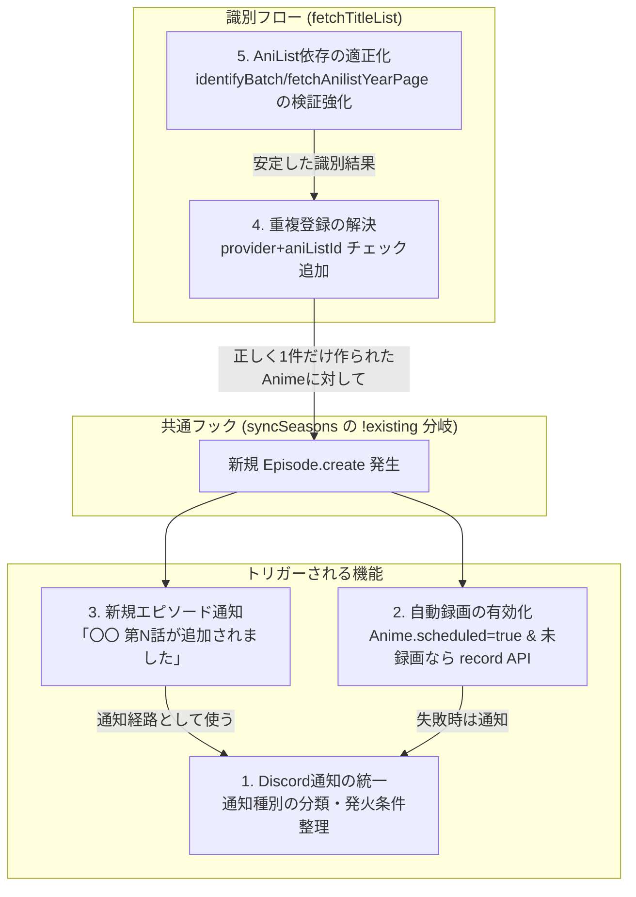

# 通知統一・自動録画・重複登録・AniList整合性 改善計画

## 目的

ユーザーから出た以下 5 つの改善要望に対して、実装前の設計方針・作業ステップ・優先度を整理する。**このドキュメントは計画のみであり、コード変更は含まない。**

1. Discord 通知を統一する（今は件数だけの通知が大量に送られて何が起きているか分からない）
2. 自動録画機能を有効化する（登録している作品に新規エピソードが来たら API を叩くだけ）
3. 登録している作品に新規エピソードが来たら Discord に通知する
4. 同じプロバイダで意味もなく作品が重複登録される問題を解決する
5. AniList への依存が適当な箇所を直す

関連ドキュメント: [recording-design.md](recording-design.md)（自動録画のフル設計）, [provider-comparison.md](provider-comparison.md)（重複登録の実例）, [schema-architecture.md](../schema-architecture.md)（識別フローの設計意図）。

---

## 0. 背景と全体像

### 5 つの要望の相互依存関係

新規エピソードの検知は「自動録画」と「Discord 通知」の**共通トリガー**になる。重複登録対策と AniList 整合性は識別フロー（`SyncService.fetchTitleList()`）の入力側の問題であり、新規エピソード検知（`SyncService.syncSeasons()`）とは別の層だが、両方とも `src/lib/sync.ts` に閉じている。



### 実装順序に関する要点

- 章 2（自動録画）と章 3（新規エピソード通知）は**同じフックポイント**（`src/lib/sync.ts` の `syncSeasons()` 内、`!existing` 分岐＝新規 `Episode.create` が発生する箇所、`sync.ts:180-190`）を使う。両方を同時期に実装し、フック自体を一度だけ整備するべき。
- 章 4（重複登録対策）は章 2・3 より**上流**（`fetchTitleList()` 内の Anime 作成箇所、`sync.ts:386-400`）の問題であり、これを直さないまま自動録画・通知を有効化すると「重複した Anime 行それぞれに対して録画 API が飛ぶ／通知が2重に飛ぶ」という新しい形の通知過多を生む。ただし重複対策は既存データのクリーンアップを要するため、着手順序は章 6 で扱う。
- 章 1（Discord 通知統一）の「最小対応（案1）」だけは他の章に依存せず単独で着手可能。

---

## 1. Discord 通知の統一

### 現状分析

- 送信経路は `src/lib/discord.ts` の `notify(webhookUrl, options)` 一本のみ（`discord.ts:23-49`）。`options = { title, description, fields?, color?, thumbnailUrl? }` を Embed 1 件にして `fetch(webhookUrl, POST)` する。送信失敗はログのみでリトライなし（`discord.ts:43-47`）。
  - 色定数（`discord.ts:19-21`）: `COLOR_ERROR = 0xed4245`（デフォルト）、`COLOR_WARN = 0xfee75c`、`COLOR_SUCCESS = 0x57f287`。
- 呼び出し元は 2 箇所のみ:
  - `src/scheduled.ts:84-92` — cron ハンドラの try/catch 全体。`SYNC_QUEUE.send()` 等が例外を吐いた時のみ発火。title「Scheduled: キュー投入失敗」+ description（エラー内容）+ fields（Cron 名）。個別発火でエラー内容を含むため、これ自体は「件数だけ」問題の主因ではない。
  - `src/queue.ts:193-204`（`queue()` 関数内） — **これが「件数だけ大量」の元凶**。バッチ処理が終わるたび（`succeeded > 0 || failed > 0` なら必ず）発火。title「Queue: バッチ完了」。description は「失敗 0 件なら『N 件 正常に完了しました』」「失敗ありなら『成功 N 件 / 失敗 M 件』」で文字通り件数のみ（`queue.ts:200`）。fields に失敗があれば`失敗一覧`（`queue.ts:194-197`、`truncateForFieldValue()` で 1024 文字まで切り詰め）。成功のみの場合は fields も空。
- `wrangler.toml:49-54` の `[[queues.consumers]]` で `max_batch_size = 5`。バッチ = 最大 5 メッセージごとに 1 通知。メッセージ種別は `fetch` / `update` / `bulk_update` / `abema_archive` / `anilist_sync` の 5 種類（`src/schemas/message.dto.ts:60-66`）が混在キューに流れ、種類を問わず同じ「バッチ完了」文言で通知される。
- レート制限対策なし。`max_concurrency = 2`（`wrangler.toml:54`）はスクレイピング先への負荷制御目的で、Discord 通知数抑制の仕組みではない。
- **通知量が膨らむ構造的理由**: `wrangler.toml:43` の cron は 5 つ（毎時 `fetch` ×4 プロバイダ×2 カテゴリ＝8 件、毎日 `expiring`、毎日 `catalog`、毎日 `abema_archive`、週次 `anilist_sync`）。1 回の `fetch` 処理から最大 `ceil(M/25)` 件の `bulk_update` が `SYNC_QUEUE` に再投入される（`queue.ts:111-117`、`BULK_SIZE = 25`）。結果、1 回の cron 実行から発生する多数のメッセージが `max_batch_size = 5` で細切れに consume され、そのたびに「N 件 正常に完了しました」という中身のない通知が多数飛ぶ。
- **過去の経緯**: コミット `cf502d0`（"enrich discord notifications and summarize batches"）で、以前は「失敗メッセージ 1 件ごとに個別通知・成功時はサイレント」だったのを「バッチ末尾に 1 回サマリー通知（成功時も送る）」に変更した。`max_batch_size = 5` と小さいため、通知過多という同種の問題が形を変えて再発している。
- 新規エピソード検知やアニメ固有の情報を含む「意味のある」通知経路は現状どこにも存在しない（章 3 で新設）。
- `docs/research/lambda-fetch-counts.md` は現行コードと食い違っており（個別失敗通知は既に削除済み）、章 6 の作業と合わせて要更新（本計画のスコープ外、別途 issue 化を推奨）。

### 問題点

- 成功のみのバッチ完了通知が、バッチサイズが小さい（5 件）ことと cron の発火頻度（最短 1 時間毎）により大量に発生し、チャンネルが「N 件 正常に完了しました」で埋まる。
- 通知に「何のアニメで何が起きたか」という情報がなく、運用上のアクション判断に使えない。
- バッチ単位（Cloudflare Queues の consumer 呼び出し単位）と、人間が意味を持って追いたい単位（cron 実行 1 回、あるいはアニメ 1 件）が一致していない。

### 設計方針（比較）

| 案 | 内容 | メリット | デメリット・コスト |
|---|---|---|---|
| **案1: 最小対応（推奨・先行実装）** | `queue.ts:193-204` のバッチ完了通知から「成功のみの場合の通知」を削除し、失敗時のみ通知する（`cf502d0` 以前の挙動に近いが、失敗内容の充実は維持する）。成功ログは既存の `logger.info` に残す。 | 実装コストが低い（既存コードの削除のみ）。即座に通知量が減る。失敗の可視性は維持される。 | cron 実行単位での「今回何件処理したか」という健全性の可視化がなくなる（元々「件数だけ」で情報量が薄かったので実質的な損失は小さい）。 |
| ~~案2: cron 実行単位でのダイジェスト集計（Discord）~~ **不採用** | Cloudflare Queues の consumer はバッチ単位（最大 5 件）でしか状態を持たないため、cron 実行 1 回をまとめて集計するには KV または Durable Object に実行 ID ごとの集計を持たせる必要がある、という案。 | 「今回の cron 実行で何が起きたか」を 1 通で把握できる。 | ユーザー判断: 「通知が来てもどうせ見ていない」ため Discord への集計送信自体が不要。**不採用**。代わりに下記「新方針」の管理画面ログページで可視化する。 |

**結論**: 案1 をまず実装し「今すぐ静かにする」。案2（Discord ダイジェスト）はユーザー判断により不採用とし、定期実行の成功・失敗の可視化は Discord ではなく管理画面の新規ページで行う（下記「新方針」参照）。

### 新方針: 管理画面「実行ログページ」の新設

ユーザー判断により、cron 実行・キュー処理の成功／失敗状況の可視化は Discord ではなく**管理画面に新設するログ/実行状況ページ**で行う（Cloudflare のメトリクスダッシュボードのような見た目を想定）。

- **バックエンド**: 新規 Prisma モデル（例: `SyncRun`）を `prisma/schema.prisma` に追加する想定。フィールド例:
  - `id`（PK）
  - `triggerType`（`cron` | `manual`）
  - `cronExpression`（nullable、`wrangler.toml` の cron 式をそのまま記録）
  - `startedAt` / `finishedAt`（`finishedAt` は実行中は nullable）
  - `succeededCount` / `failedCount`
  - `status`（`running` | `completed` | `failed`）
  - `queue.ts` の `queue()` 関数（バッチ処理完了時、`queue.ts:193-204` 付近）と `scheduled.ts` の cron 実行時に、既存の Discord 通知呼び出しの近くでこのテーブルへ記録を追加する想定。
  - Hono の Zod OpenAPI ルート（`OpenAPIHono` + `createRoute`、CLAUDE.md の規約に従う）で以下を新設する:
    - `GET /api/admin/logs`（一覧、ページネーション。query パラメータは `schemas/*.dto.ts` にパスカルケースで定義した Zod スキーマで `createRoute({ request: { query } })` に宣言し、ハンドラでは `c.req.valid('query')` で受け取る）
    - `GET /api/admin/logs/stats`（集計: 成功率、直近 N 件の傾向）
- **フロントエンド**: TanStack Router のファイルベースルーティング規約（ディレクトリで分ける）に従い `src/app/routes/admin/logs/index.tsx` を新設する想定。既存の管理画面配下（`src/app/routes/admin/` には現状 `index.tsx`（ハブページ）、`nagisa/index.tsx`、`unidentified/index.tsx` が存在する。実態は Read で確認済み）と同じ階層に置き、`src/app/routes/admin/index.tsx` の `ADMIN_ITEMS` にも項目を追加する想定。表示内容は Cloudflare Metrics ダッシュボード風（直近の実行一覧テーブル + 成功率のサマリーカード）とする。
- **既存の運用エラー通知は維持する**: `scheduled.ts:84-92` の cron 投入失敗時の Discord 通知（即時性が必要な重大失敗）はそのまま残す。これは「定期実行の結果を毎回可視化する」目的の通知（今回不採用にした案2）とは性質が異なり、緊急度の高い異常系のみを扱う経路として引き続き Discord を使う。

### 通知種別の分類（統一後の姿）

定期実行の成功・失敗の可視化は Discord から管理画面のログページに移すため、「Discord 通知」と「ログページ」の 2 系統に分けて整理する。

**Discord 通知（維持・新設分含む）**

| 種別 | title 文言（例） | color | 発火条件 | 実装状況 |
|---|---|---|---|---|
| 運用エラー通知 | `Scheduled: キュー投入失敗` | `COLOR_ERROR` | cron ハンドラで例外発生時 | 既存維持（`scheduled.ts:84-92`） |
| 定期実行サマリー（失敗時のみ） | `Queue: 処理失敗` | `COLOR_WARN` | バッチ内に 1 件以上失敗があった場合のみ | 章1 案1 で改修（成功のみの場合は送らない）。頻度が低いため Discord のままで問題にならない |
| 新規エピソード通知 | `📺 〇〇 第N話が追加されました` | `COLOR_SUCCESS` | `syncSeasons()` の `!existing` 分岐でエピソード新規作成時（章3） | 新設。頻度が低いため Discord のままで問題にならない |
| 自動録画通知 | `🎬 〇〇 の録画を開始しました` / `⚠️ 〇〇 の録画リクエストに失敗しました` | `COLOR_SUCCESS` / `COLOR_ERROR` | 自動録画トリガーで Nagisa への録画リクエスト送信時（成功・失敗、章2） | 新設（失敗時のみ通知にするかは章2実装時に決定）。頻度が低いため Discord のままで問題にならない |

**ログページ（管理画面、新設）**

| 種別 | 内容 | 記録タイミング | 実装状況 |
|---|---|---|---|
| 定期実行の成功・失敗記録 | cron 実行・キュー処理バッチごとの `succeededCount`/`failedCount`/`status` | `queue.ts` のバッチ完了時、`scheduled.ts` の cron 実行時に `SyncRun` へ記録 | 新設。Discord からは削除（本来ここに来るはずだった「件数だけ通知」を集約表示に置き換える） |

### 実装ステップ

- [ ] `queue.ts:193-204` の通知条件を `failed > 0` のみに変更する（成功のみの場合は `notify()` を呼ばない）
- [ ] title を「Queue: バッチ完了」から「Queue: 処理失敗」等、失敗時であることが分かる文言に変更する
- [ ] 章3・章2 の新設通知（新規エピソード通知・自動録画通知）を同じ `notify()` 関数経由で実装する（`discord.ts` の変更は不要、呼び出し追加のみ）
- [ ] `docs/research/lambda-fetch-counts.md` を現行実装に合わせて更新する（別チケットでも可）
- [ ] `prisma/schema.prisma` に `SyncRun` モデルを追加する
- [ ] `queue.ts`（バッチ完了時）・`scheduled.ts`（cron 実行時）に `SyncRun` への記録処理を追加する
- [ ] `GET /api/admin/logs` / `GET /api/admin/logs/stats` を `OpenAPIHono` + `createRoute` で追加し、Zod スキーマを `schemas/*.dto.ts` にパスカルケースで定義する
- [ ] `src/app/routes/admin/logs/index.tsx` を新設し、実行一覧テーブル + 成功率サマリーカードの UI を実装する（`src/app/routes/admin/index.tsx` の `ADMIN_ITEMS` にも項目を追加する）

### 優先度・依存関係

- **優先度: 高**。他の章に依存せず単独で着手可能で、ユーザーの一番の不満（通知過多）を即座に解消できる。ログページ新設部分は章2（自動録画、最優先）と並行して早期に着手する（章6 参照）。
- 章2・章3 の新設通知は本章の分類表に従って実装する（依存: 章2・章3 の実装完了後に本章の表を最終形にする）。

---

## 2. 自動録画機能の有効化

### 現状分析

- `docs/features/recording-design.md` に既に詳細設計書が存在する。即時録画とは別に「自動録画」を定義し、Phase A（DB マイグレーション `Episode.recordStatus` enum 化 + Nagisa `POST /api/queues` 非同期化 202 応答）→ Phase B（Webhook 受信 `POST /api/webhooks/record-status`）→ Phase C（エピソード単位ダウンロード指示 `POST /:id/record/episodes`）→ Phase D（自動録画本体: cron → キュー → Nagisa 指示）の順で依存関係がある設計（`recording-design.md:530-575` の実装順序図参照）。
- 実装状況:
  - **Phase A: 一部のみ**。Nagisa 側は 202 + jobs 配列を返す形に更新済み（`docs/features/nagisa-api.md` 記載）だが、Workers 側 DB は今も `Episode.recorded: Boolean`（`prisma/schema.prisma:70`）、`Anime.recorded: Boolean`（`prisma/schema.prisma:26`）のまま。`recordStatus` enum は未導入。
  - **Phase B: 実装済み**。`src/routes/webhooks.ts:12-99` に `POST /api/webhooks/record-status` が存在。ただし `recorded: true/false` のboolean更新のみで、`completed` のときだけ `recorded = true` にする（`webhooks.ts:76-83`）。`downloading` の中間ステータス反映は行っていない。
  - **Phase C: 未実装**。現行の `POST /api/anime/:id/record`（`src/routes/anime.ts:352-453`）は作品全体の未録画エピソードをまとめて 1 回の Nagisa リクエストに詰めて送るのみ（`anime.ts:387-417`）。
  - **Phase D（自動録画本体）: 完全に未実装**。`auto_record_check` / `record` 相当のコードはリポジトリに存在しない（設計書内の言及のみ）。`src/schemas/message.dto.ts:60-66` の discriminated union には `fetch`/`update`/`bulk_update`/`abema_archive`/`anilist_sync` の 5 種のみ。`src/scheduled.ts` の cron switch（`scheduled.ts:40-83`）にも該当 case はなく、`wrangler.toml:43` の crons にも該当 cron 式は無い。`src/queue.ts` の switch 文（`queue.ts:107-172`）にも `record` case はない。
  - `Anime.scheduled` フィールド（`prisma/schema.prisma:25`、「録画予約済み」コメント付き）は DB・API レベルで存在しフロントから予約可能だが、このフラグを実際に参照して自動ダウンロード指示を出す消費側ロジックが存在しない（**値をセットしても何も起きない、死んだフラグ**）。
- 自動録画すべき対象の抽出条件は `Anime.scheduled = true` かつ `Episode.recorded = false` かつ `releaseDate <= now` の組み合わせで抽出可能（`recording-design.md` のクエリ案と一致）。

### 問題点

- 「録画予約」UI が機能として死んでいる（フラグを立てても何も起きない）。ユーザー体験として最も分かりやすい形で欠落している。
- `recording-design.md` のフルスコープ（`recordStatus` enum 化・Webhook 詳細ステータス管理・エピソード単位指示）は既存見積りで**約 6.5 日**相当と大きく、ユーザーの要望文言「新規エピソードが来たら API を叩くだけ」に対しては過剰である可能性が高い。

### 設計方針（比較）

| 案 | 内容 | メリット | デメリット・コスト |
|---|---|---|---|
| 案A: フル実装（recording-design.md Phase A〜D） | `Episode.recordStatus` enum 化、Webhook の `downloading`/`completed`/`failed` 詳細反映、エピソード単位の録画指示 API、`auto_record_check`/`record` キューメッセージ型を新設し cron から起動。 | 将来のフロントエンド進捗表示（バッジ表示等、`recording-design.md` 章4）まで見据えた完成度の高い実装。エピソード単位の細かい制御が可能。 | 工数大（約 6.5 日、DB マイグレーション・Nagisa 側改修含む）。ユーザーの要望に対して明らかに過剰スコープ。 |
| **案B: ミニマル実装（推奨）** | 既存 `Episode.recorded`（boolean）をそのまま維持。新規エピソード検知フック（`sync.ts:180-190` の `!existing` 分岐）から、既存の `POST /api/anime/:id/record` 相当のロジック（`anime.ts:387-417` の「未録画エピソード収集 → Nagisa へ 1 リクエスト」部分）を共通関数として切り出し、`Anime.scheduled = true` の作品であれば直接呼び出す。新規の DB マイグレーションや Webhook 改修は不要。 | 工数小。既存コードの再利用のみで「新規エピソードが来たら API を叩くだけ」というユーザー要望に正確に対応する。既存の Phase B（Webhook）はそのまま活かせる（`recorded=true` 反映は既存経路のまま機能する）。 | エピソード単位の細かい進捗管理（`queued`/`downloading` の区別）はできない。将来エピソード単位録画が必要になった場合は改修が必要（が、これは案A でも同様に別途工数がかかるため損失ではない）。 |

**結論**: ユーザー要望の文言（シンプルに「API を叩くだけ」）およびユーザー判断により、**案B を正式な実装方針として確定する**。ユーザーの意向により早期着手を優先する。将来的にエピソード単位の進捗表示が必要になった場合は、既に実装済みの Phase B（Webhook）を活かして Phase C・D 相当を段階的に追加すればよく、案B は案A への移行を妨げない。

### 実装ステップ（案Bベース）

- [ ] `src/routes/anime.ts:387-417` の「未録画エピソード収集 → Nagisa へ 1 リクエスト送信」ロジックを、Hono ルートハンドラから独立した関数（例: `src/lib/recording.ts` の `requestRecording(prisma, env, animeId)`）として切り出す（既存の `POST /:id/record` ルートはこの関数を呼ぶだけにする）
- [ ] `src/lib/sync.ts` の `syncSeasons()`（`sync.ts:110-214`）内、`!existing` 分岐でエピソード新規作成後、当該 `Anime.scheduled` を確認し `true` であれば上記関数を呼ぶフックを追加する（呼び出しタイミングは 1 アニメの全エピソード処理が終わった後にまとめて 1 回、章3 の通知粒度と揃える）
- [ ] 録画リクエスト送信の成功・失敗を章1 の通知種別表に従って Discord 通知する
- [ ] `Anime.scheduled` を参照する箇所が増えるため、フロントエンドの「録画予約」トグルの説明文言（「予約すると新規エピソードを自動録画します」等）を UI 側で見直す（本計画のスコープ外、別タスクとして提起）

### 優先度・依存関係

- **優先度: 最優先**。ユーザー要望の中核機能であり、既存コードの再利用で低コストに実現できる。**ユーザー指示により最優先で着手する**（章6 参照）。
- **依存**: 章3（新規エピソード通知）と同じフックポイントを使うため、実装順序を揃える（同一 PR ないし連続した PR での実装を推奨、章6 参照）。
- **依存**: 章4（重複登録対策）が未着手のままだと、重複した `Anime` 行それぞれに対して録画リクエストが飛ぶ可能性がある。実害は限定的（同じコンテンツへの重複リクエストで Nagisa 側は冪等に近い）だが、章4 は本章と並行〜後続で対応する。

---

## 3. 新規エピソード検知時の Discord 通知

### 現状分析

新規エピソード検知は 2 段階で行われている:

1. **タイトル一覧レベルのバッジ付与**: `SyncService.fetch()`（`sync.ts:273-288`）。`lambda/fetch/handlers/title-list.ts:22-39` がプロバイダの `new_episode`/`coming_soon`/`catalog` カテゴリ一覧を返す（プロバイダ API 側の「新着」フラグをそのまま利用し、独自差分検知はしていない）。`sync.ts:328-359`（`fetchTitleList()` 内）で `badgesForCategory` を見て `Anime.badge` を更新／リセットする。
2. **エピソード実体レベルの差分検知**: `sync.ts:110-214` の `syncSeasons()`。DB の既存エピソード（`existingEpisodes`）と、Lambda `/title_info` から取得した最新の全エピソードを比較。`episode.episodeNumber` が既存に無ければ `createEpisode()`（`sync.ts:184`, 実装本体は `sync.ts:246-270`）で新規作成し `stats.episodesCreated` をインクリメントする。

この `stats` は `apply-detail-done` ログ（`sync.ts:97-106`）に出すだけで、**Discord 通知や自動録画トリガーには全く接続されていない**。

新エピソード検知の最も確実なフックポイントは `syncSeasons()` の `!existing` 分岐（`sync.ts:180-190`、新規 `Episode.create` 発生箇所）である。`src/lib/discord.ts` の `notify()` は既に存在し `queue.ts`/`scheduled.ts` でエラー通知に使われているので、同じ関数を新エピソード検知時に呼び出す形で拡張できる。

### 問題点

- 新規エピソードが来たことをユーザー（運用者）が知る手段が現状ログ以外にない。
- `syncSeasons()` はエピソード単位でループ処理するため、素朴にフックすると 1 エピソード 1 通知になり、章1で問題視した「通知過多」を新たな形で再発させるリスクがある。

### 設計方針

新エピソード検知の通知粒度は「1 エピソード 1 通知」ではなく、**1 回の `update` 処理・1 アニメでまとめて通知する**。`applyDetail()`（`sync.ts:87-107`）が `syncSeasons()` の呼び出し元であり、既に `stats.episodesCreated` を集計しているため、`applyDetail()` の末尾（`stats` 集計後、`syncLogger.info` の直後）で `stats.episodesCreated > 0` の場合に 1 回だけ通知を送るのが自然な実装単位になる。

| 選択肢 | 内容 | 評価 |
|---|---|---|
| 1 エピソード 1 通知 | `createEpisode()` 呼び出しの都度通知 | 不採用。通知過多を再発する |
| **1 アニメ 1 通知（推奨）** | `applyDetail()` 末尾で `stats.episodesCreated > 0` のときに 1 回通知、fields に新規エピソードのリストを列挙 | 採用。粒度が章1の分類表と一致し、章2（自動録画）とも同じ単位で連携できる |

章2（自動録画）と連携する場合の通知文言例:

```
title: 📺 〇〇 第5話が追加されました
description: 新規エピソードを検出しました
fields:
  - name: 録画予約
    value: 予約済みのため録画を開始します   # Anime.scheduled=true の場合
    # または
    value: 録画予約はされていません          # Anime.scheduled=false の場合
```

### 実装ステップ

- [ ] `sync.ts` の `applyDetail()`（`sync.ts:87-107`）に、`stats.episodesCreated > 0` の場合の通知呼び出しを追加する（`notify()` を呼ぶための `DISCORD_WEBHOOK_URL` を `SyncService` のコンストラクタ経由で渡すか、呼び出し元の `queue.ts`/`webhooks.ts` 等で結果を受け取って通知するかは実装時に決定。既存の `SyncService` が Discord を知らない設計を維持するなら後者を推奨）
- [ ] 通知の fields に、今回作成された新規エピソードの一覧（シーズン番号・話数）を含める（`truncateForFieldValue()` を再利用可能）
- [ ] 章2 の自動録画フックと同じ場所（`syncSeasons()` 呼び出し元）に実装し、通知文言に録画予約状況を含める
- [ ] 章1 の通知種別分類表に本通知を追加し、色・title を確定する

### 優先度・依存関係

- **優先度: 高**。要望3単体でも価値があり、章2（自動録画）の実装判断（録画予約済みかどうか）にも使う情報を扱うため、章2 と合わせて実装する。
- **依存**: 章2 と同じフックポイント（`syncSeasons()`／`applyDetail()`）を使うため、実装順序・PR を揃える。

---

## 4. プロバイダ重複登録の解決

### 現状分析

- **DB 制約**: `Anime` モデルは `@@unique([provider, contentId])`（`prisma/schema.prisma:34`）のみ。`aniListId` にはユニーク制約もなく、`@@index([aniListId])`（`schema.prisma:37`）は単純な検索用インデックス。
- **登録ロジック**: `SyncService.fetchTitleList()`（`sync.ts:291-458`）が新規タイトル作成の唯一の経路。`findExistingContentIds()`（`sync.ts:28-39`）/ `findKnownContentIds()`（`sync.ts:42-61`）で **contentId 単位**の重複チェックのみを行い `prisma.anime.create()`（`sync.ts:386-400`）を呼ぶ。**同一 provider で既に同一 aniListId が登録済みかどうかのチェックは一切ない**。
- **決定的な実例**: `docs/features/provider-comparison.md:9-11`。Amazon で同一作品が「New パンスト」（ASIN `B0FF2WZYM4`）と「New パンスト（CENSORED版）」（ASIN `B0FFL2WFG8`）という**別コンテンツ ID**で 2 件配信されている（`provider-comparison.md:24-25`, `:150`）。`src/lib/metadata/anilist.ts` の `cleanTitle()`（`anilist.ts:15-98`）はタイトル全体が `【タイトル】` の形式でない限り、文字列中のどこにあっても `【...】` ブラケット（装飾）を丸ごと除去する処理を持ち、今回の実例では末尾に付いた `【CENSORED版】` が削除対象になるため、両 ASIN のタイトルは正規化後に同一の検索クエリに収束しうる構造になっている。結果として `identifyTitlesViaD1` で**同一の aniListId** に解決されるが、`sync.ts` は contentId ベースのチェックしかしないため、両方とも「新規」と判定され、**同じ aniListId・同じ provider:"amazon" で 2 つの Anime 行が作成される**。ユーザー画面には同じ作品が 2 枚カードとして重複表示される。
- `src/lib/providers/amazon/index.ts` の重複排除処理（`dedupeBy(...,(t) => t.contentId)`）も **contentId 単位**でしか行っておらず、この種の重複は素通りする。`docs/provider-data-mapping.md:114` にも「titleID で重複削除してマージする」と明記され、設計時点からdedup キーが contentId（titleID）である前提になっている。**aniListId を軸にした dedup は設計にも実装にも存在しない**。
- **関連リスク**: `UnidentifiedAnime` にも `@@unique([provider, contentId])`（`schema.prisma:114`）のみで同様の問題。`findKnownContentIds()`（`sync.ts:42-61`）は「一度でも識別を試行した contentId」を記録し**以後そのcontentIdを永久にスキップ**する。AniList 側のデータが後から揃っても再識別されない（`/admin/unidentified` 経由の手動操作以外に自動リトライ経路がない）。

### 問題点

- 同一作品が provider 内で複数の見た目上の「作品カード」として表示され、ユーザー体験を損なう。
- 重複した Anime 行それぞれに録画予約・録画リクエストが行われる可能性がある（章2 の自動録画実装後は実害が具体化する）。
- `UnidentifiedAnime` の永久スキップにより、AniList 側のデータが後から揃った場合の自動回復経路がない。

### 設計方針（比較）

`fetchTitleList()` の新規作成前に `provider + aniListId` の既存チェックを追加する方向性を軸に、重複が見つかった場合の扱いを比較する。

| 案 | 内容 | メリット | デメリット・コスト |
|---|---|---|---|
| **案X: スキップ + ログ/Discord警告（推奨・第一段階）** | `fetchTitleList()`（`sync.ts:381-424` 付近の作成ループ）で `prisma.anime.create()` の前に「同一 `provider` + `aniListId` の既存行があるか」を確認する。既存があればスキップし、`UnidentifiedAnime` 相当のテーブルまたはログに「重複候補」として記録、Discord に警告通知する（章1 の通知種別に「重複検知」を追加してもよい）。 | 実装がシンプルで、誤って正しく別作品（例: 前後編で別々の aniListId になるべきものが同一に誤識別された場合）を統合してしまうリスクがない。人間がレビューして手動統合できる。 | 統合されないため、既に重複登録済みの過去データはそのまま残る（別途クリーンアップが必要）。 |
| 案Y: 既存行への統合 | 検知した重複を自動的に 1 行にマージする（どちらのコンテンツ ID を残すか、エピソード情報をどう統合するかのロジックが必要）。 | ユーザー視点で即座に重複が解消される。 | マージロジックの設計・実装コストが高い（どちらを正とするか、エピソード突き合わせが必要）。誤爆時のリカバリが難しい（統合を取り消せない）。 |

**結論**: 案X をまず実装し、重複候補の検知と可視化を先行させる。統合（案Y）は運用で重複パターンの傾向が見えてから検討する。

### 新方針: 重複検知時の挙動を管理画面の設定から選べるようにする

ユーザー判断により、重複候補が見つかった際の最終的な扱い（スキップ確定／統合／保留）を自動で決め打ちせず、**管理画面の設定画面から挙動を選べるようにする**。

- **設定項目の例**: 「重複候補検出時の挙動」として以下の選択肢を管理画面に追加する想定。
  - `自動スキップ`（デフォルト） — 案X の挙動。重複候補をログ/Discord 警告のみで記録し、`Anime` 行は作成しない。
  - `保留（手動確認待ち。Discord 警告のみ）` — 重複候補を検出したことだけを警告通知し、判断は運用者が `/admin/unidentified` 等の既存管理画面操作に任せる。
  - 統合（マージ）は自動化コストが高い（案Y、どちらのコンテンツ ID を残すか・エピソード情報の突き合わせが必要）ため、**設定の選択肢からは外す**。手動での統合は既存の管理画面操作の範囲で行う、という現実的な線引きとする。
- **設定値の保存先**: 以下を比較する。

  | 案 | 内容 | 評価 |
  |---|---|---|
  | 環境変数 / KV | `wrangler.toml` の `[vars]` や KV に固定値を持つ | 実装は簡単だが、値を変えるにはデプロイまたは別経路の操作が必要で「管理画面から設定を変える」というユーザー要望に対して迂遠 |
  | **D1 テーブル（推奨）** | 既存の D1 に `AppSettings` のような Key-Value テーブルを新設し、Prisma 経由で読み書きする | 管理画面から即時に変更・反映できる。将来的な設定項目の追加にも同じテーブルで拡張できる |

  **推奨**: D1 テーブル（`AppSettings` 等）での永続化。将来的な設定項目追加への拡張性を重視する。
- **フロントエンド**: 既存の管理画面配下（`src/app/routes/admin/` 配下。実態は `index.tsx`（ハブ）、`nagisa/index.tsx`、`unidentified/index.tsx` — Read で確認済み）に設定ページ（例: `src/app/routes/admin/settings/index.tsx`）を新設する想定。

**DB スキーマ制約化について**: `@@unique([provider, aniListId])` を追加すれば同種の重複を DB レベルで防げるが、**既存の重複データのクリーンアップが先に必要**（既存重複行が残ったままマイグレーションを当てると失敗する）。案X の運用で重複がある程度解消されてから、制約追加を検討する。

**`UnidentifiedAnime` の永久スキップ問題への改善案**: `findKnownContentIds()`（`sync.ts:42-61`）が返す「既知の contentId」に有効期限を設ける、または `UnidentifiedAnime` に `lastRetryAt` を持たせて N 日ごとに再識別を試みる cron を追加する。本計画では改善方向のみ示し、実装ステップは章5（AniList整合性）と合わせて扱う。

### 実装ステップ

- [ ] 既存 DB 内の重複（同一 `provider` + `aniListId` を持つ複数 `Anime` 行）を洗い出す調査スクリプトを `scripts/` に作成する（読み取りのみ、`prisma.anime.groupBy` 等で件数を集計）
- [ ] 調査結果を元に、重複データをどう扱うか（削除・統合・保留）の判断基準をユーザーと確認する
- [ ] `fetchTitleList()`（`sync.ts:381-424`）の作成ループに `provider + aniListId` の既存チェックを追加する（案X: スキップ + 警告）
- [ ] 重複候補の Discord 警告通知を追加する（章1 の通知種別表に追加）
- [ ] `UnidentifiedAnime` の再識別リトライ経路（cron or 手動トリガー）を設計する（実装は章5 と合わせて検討、本計画では設計方針のみ）
- [ ] D1 に `AppSettings`（Key-Value）テーブルを新設し、「重複候補検出時の挙動」（`自動スキップ` / `保留`）を保存できるようにする
- [ ] `src/app/routes/admin/settings/index.tsx` を新設し、上記設定を管理画面から変更できる UI を実装する
- [ ] （将来検討）既存重複データのクリーンアップ後、`@@unique([provider, aniListId])` の追加を検討する

### 優先度・依存関係

- **優先度: 中〜高**。ユーザー体験に直接影響するが、既存データのクリーンアップという前提作業があるため、章2（自動録画）が重複行に対して二重にリクエストを送るリスクを避けたい場合は章2 より先に着手するのが望ましい。
- **依存**: 章5（AniList 依存の適正化）の識別結果の安定性向上と合わせて実施するとより効果的（識別がブレると重複チェックの前提である「同一 aniListId」判定自体が不安定になる）。

---

## 5. AniList 依存の適正化

### 現状分析

AniList 依存箇所一覧（Zod 検証の有無込み）:

| 箇所 | 役割 | Zod 検証 |
|---|---|---|
| `src/lib/metadata/anilist.ts` `identifyAniList()`（`anilist.ts:161-182`） | 単発検索 | `MetadataResponseSchema.safeParse`（`anilist.ts:179`）で検証あり |
| `src/lib/metadata/anilist.ts` `identifyBatch()`（`anilist.ts:203-242`） | 複数タイトルをエイリアスで1リクエストにまとめる検索 | outer envelope は `as { data: Record<...> }` の型アサーションのみ（`anilist.ts:220`）。media 単体だけ `MetadataMediaSchema.safeParse`（`anilist.ts:225`）。単発検索は検証済みなのにバッチ版だけ検証が甘い非対称な実装 |
| `lambda/fetch/handlers/identify.ts` | Lambda 側 `/identify` エンドポイント | `AniListBatchResponseSchema`（`identify.ts:41-43`）+ `MetadataMediaSchema`（`identify.ts:103`）で最も丁寧に検証 |
| `src/lib/metadata/anilist-fetch.ts` `fetchAnilistYearPage()`（`anilist-fetch.ts:39-69`） | 年単位でカタログ全件取得 | **Zod スキーマなし**。`as { data?: {...}, errors?: unknown }`（`anilist-fetch.ts:63-66`）の生の型アサーションのみ |
| `src/lib/metadata/anilist-sync.ts` `upsertEntry()`（`anilist-sync.ts:29-50`）, `syncAnilistMediaYear()`（`anilist-sync.ts:56-81`） | 取得結果を D1 ローカルキャッシュ `AnilistMedia` に upsert | 検証なし |
| `src/lib/metadata/local-anilist.ts` | D1 キャッシュ済みの `AnilistMedia` をタイトル正規化キーで検索し識別（**現在の本番経路**） | Prisma 生成型のみ、独自 Zod なし |
| `src/schemas/providers/metadata.dto.ts` | `MetadataMediaSchema`/`MetadataResponseSchema`/`TitleMetadataSchema` の Zod スキーマ本体 | — |

- **レート制限対応**: `fetchWithRetry()`（`anilist.ts:149-159`）と `fetchAnilistYearPage()`（`anilist-fetch.ts:54-58`）で 429 の Retry-After を見て指数バックオフあり（過去のコミットで強化済み）。この点は堅牢。
- **本番の識別フローの実態**: `sync.ts:361-363` のコメントに明記の通り「AniList search backend 障害中なので Lambda `/identify` は使わず、事前 sync 済みの `anilist_media` テーブルを normalized title で引く」。つまり**本番の識別処理はリアルタイム AniList 呼び出しを経由せず、週次 cron（`wrangler.toml:43` の `0 5 * * SUN`）で作られた静的スナップショット（`anilist_media` テーブル）へのローカル文字列マッチングのみ**。`AniListAdapter`/Lambda `/identify` 経路はオフラインスクリプト用に残っているだけで、本番フローでは実質デッドパスに近い。
- **Null/レスポンス変更への脆弱性の具体例**:
  1. `identifyBatch()`（`anilist.ts:220`）: GraphQL は部分エラー時に HTTP 200 + `{errors: [...]}`（data キーなし）を返すことがある。この場合 `data.data` が `undefined` になり `data.data[...]` で TypeError（未捕捉）。
  2. `fetchAnilistYearPage()`（`anilist-fetch.ts:63-68`）: `json.data` の有無だけ見ているが `Page` や `pageInfo` が存在するかは無検証。
  3. `upsertEntry()`（`anilist-sync.ts:31-38`）: `e.title.native`、`e.startDate.year` 等に optional chaining なしでアクセス。フィールド欠落で年次同期が丸ごと失敗する。
  4. `Anime.aniListId` は必須リレーション（`anilistMedia AnilistMedia @relation(...)`、`schema.prisma:32`）だが D1 側で FK 制約を貼っていない（`schema.prisma:30-31` のコメントで明記、RedefineTables 由来のcascade削除回避のため）。同期タイミングのズレで存在しない aniListId を指す**孤立参照が黙って保存されうる**。
- **ドキュメントとの食い違い**: `docs/schema-architecture.md:145-163` は「MetadataAdapter.identify() → TitleDetailedInfo → SyncService → upsert」という設計を描いているが、実際は上記の通り D1 ローカルキャッシュへの文字列マッチング。`docs/provider-data-mapping.md` の `syncTitle`・`checkNewEpisodes`・`tmdbId` upsert キー等の記述は現行 `sync.ts` に存在しない関数名・カラム。`Anime.tmdbId` カラムは過去に追加されたが現行 `schema.prisma` には存在せず、`src/lib/metadata/tmdb.ts` も現行コードから一切 import されていない（呼び出し元 0 件、デッドコード）。Netflix 対応案（TMDB 必須）はこの「TMDB 依存を切った」現状と矛盾する。

### 問題点

優先度別に整理する（このまま章6 の優先度にも引き継ぐ）。

| 優先度 | 課題 | 理由 |
|---|---|---|
| **高** | `identifyBatch()`（`anilist.ts:220`）の outer envelope に Zod 検証を追加する | GraphQL の部分エラーレスポンスで未捕捉 TypeError が発生しうる。クラッシュバグ |
| **高** | `fetchAnilistYearPage()`（`anilist-fetch.ts:63-66`）に Zod 検証を追加する | `Page`/`pageInfo` の型保証がなく、レスポンス形状変化でサイレントに壊れる |
| **高** | `upsertEntry()`（`anilist-sync.ts:31-38`）に optional chaining を追加する | フィールド欠落で週次同期全体が失敗する、サイレント失敗の温床 |
| 中 | `Anime.aniListId` 孤立参照の定期整合性チェック | FK 制約がない設計上の妥協点であり、放置すると識別結果に無関係な参照が紛れる可能性がある |
| 低・要方針決定 | ドキュメント（`schema-architecture.md`, `provider-data-mapping.md`）と実装の食い違いの解消 | 実害はないが、将来の開発者が誤った設計を前提にコードを書くリスクがある |
| 低・確定済み | TMDB 復活の当否（Netflix 対応案との整合） | ユーザー判断により**不採用と確定**（後述「確定した方針」参照）。`tmdb.ts` の扱いのみ後続タスクとして残る |

### 設計方針

- 高優先度の3項目はいずれも「クラッシュ・サイレント失敗を防ぐ堅牢性バグ」であり、CLAUDE.md の Zod 使用規約（バリデーションには Zod を使用する）にも合致する形で、既存の `src/schemas/providers/metadata.dto.ts` のスキーマ群を再利用して修正する（新規スキーマは既存の Zod スキーマ命名規則 `schemas/*.dto.ts` パスカルケースに従う）。**ユーザー判断により、この高優先度3項目（および中優先度の孤立参照チェック）を最優先で実装する方向で確定した**（「AniList をしっかりチェックできるように」というユーザー指示に対応する）。
- 中優先度の孤立参照チェックは、既存の週次 `anilist_sync` cron（`scheduled.ts:66-79`）の枠に相乗りするか、別途軽量な整合性チェック cron を新設するかを実装時に判断する。
- ドキュメント整合性（`schema-architecture.md`/`provider-data-mapping.md`）は本計画のスコープ外として別途ユーザー判断が必要のまま残す。**TMDB 依存の復活については、ユーザー判断により不採用と確定した**（Netflix 対応案との整合は別途扱う）。

### 実装ステップ

- [ ] `identifyBatch()`（`anilist.ts:220`）の outer envelope（`{ data: Record<string, { media: unknown[] }> }` 相当）に Zod スキーマを新設し `safeParse` する
- [ ] `fetchAnilistYearPage()`（`anilist-fetch.ts:63-66`）のレスポンスに Zod スキーマ（`Page`/`pageInfo`/`media` の形状）を新設し `safeParse` する
- [ ] `upsertEntry()`（`anilist-sync.ts:31-38`）で `e.title?.native`、`e.startDate?.year` 等 optional chaining を徹底する（または入力を Zod でパースしてから使う）
- [ ] `Anime.aniListId` の孤立参照を検出する読み取り専用スクリプトを `scripts/` に作成し、定期実行または手動実行で監視する
- [ ] （別途ユーザー判断）`docs/schema-architecture.md` / `docs/provider-data-mapping.md` の記述更新方針を決める
- [ ] `src/lib/metadata/tmdb.ts` の扱い（デッドコードとして削除するか、コメントで「TMDB 復活は不採用」と明記して残すか）を決める（TMDB 復活自体はユーザー判断により不採用と確定済み。これは後処理タスク）

### 優先度・依存関係

- **優先度: 最優先**（堅牢性バグ3件 + 孤立参照チェック）。ユーザー指示により「AniList をしっかりチェックできるように」することが最優先事項として確定した。ドキュメント整合性は引き続き**低・要方針決定**として残る。
- 他章との依存は薄いが、章4（重複登録対策）の識別結果の安定性の土台になるため、章4 と同時期またはやや先行して着手すると効果的。ただし本章自体は他章に依存せず単独で早期着手できる。

---

## 6. 全体の優先順位と実装順序

### 推奨実装順序

ユーザー指示により、章2（自動録画）と章5（AniList 堅牢性）が最優先事項として確定した。これを踏まえて実装順序を見直す。

1. **自動録画ミニマル実装（章2 案B）を最優先で早期着手** — ユーザー指示による最優先事項。既存コードの再利用で低コストに実現できる。
2. **新規エピソード通知（章3）を同フックに相乗り** — 章2 と同じ `syncSeasons()`/`applyDetail()` のフックポイントを使うため、章2 と同時期に実装する。
3. **AniList 堅牢性修正（章5）も並行して早期着手** — ユーザー指示による最優先事項。高優先度の3項目（`identifyBatch`/`fetchAnilistYearPage`/`upsertEntry`）は他章に依存せず単独で着手できるため、章2 と並行して進める。
4. **通知統一 + ログページ新設（章1）** — `queue.ts` の通知条件修正（0.25日）自体は章2 と並行できるが、ログページ新設（`SyncRun` モデル + API + フロントページ）は実装コストがやや高いため、章2・章5 よりやや後追いで着手してもよい。
5. **重複登録対策 + 設定UI（章4）** — 既存データ調査・クリーンアップ判断が前提のため、引き続き並行〜後続で対応する。章5（AniList 堅牢性）が識別結果の安定性の土台になるため、章5 の完了と近い時期に重複チェック本体を完了させることを推奨する。

この順序を選ぶ理由:

- 章2・章5 はいずれもユーザーが最優先で着手したいと明言した項目であり、かつ他章への依存が薄く単独で早期着手できる。
- 章2・章3 は同じフックを使うため、別々の PR に分けると同じ箇所に 2 回手を入れることになり非効率。1 回のフック整備で両方を実現する。
- 章1 のログページ新設はバックエンド（新規 Prisma モデル + API）とフロントエンド（新規ページ）の両方を要し、章2・章5 より実装コストが高いため、最優先2章の後追いでも実害が小さい（Discord 通知過多という既存の不満自体は `queue.ts` の条件修正だけで先に緩和できる）。
- 章4 は既存重複データのクリーンアップという前提作業が必要で、着手から完了までのリードタイムが長い。章5 の識別安定化が前提になるため、章5 と近い時期に重複チェック本体を完了させるのが合理的。

```mermaid
gantt
  title 推奨実装順序（工数は目安、営業日単位）
  dateFormat X
  axisFormat %s

  section 2+3. 自動録画(最優先) + 新規エピソード通知
    フック共通化 + 自動録画(案B) :a1, 0, 2
    新規エピソード通知           :a2, after a1, 1

  section 5. AniList堅牢性(最優先)
    identifyBatch/fetchAnilistYearPage/upsertEntry :b1, 0, 1
    孤立参照チェックスクリプト     :b2, after b1, 1

  section 1. 通知統一 + ログページ新設
    queue.ts のバッチ完了通知修正 :c1, 0, 1
    SyncRunモデル + 記録処理      :c2, after a1, 1
    API追加(logs/logs-stats)     :c3, after c2, 1
    フロントページ追加           :c4, after c3, 1

  section 4. 重複登録対策 + 設定UI
    既存重複調査スクリプト        :d1, 0, 1
    設定UI(挙動選択)              :d2, after d1, 1
    重複チェック追加(案X)         :d3, after b1, 2
```



### 各章の工数感

`recording-design.md` の見積り粒度感（半日〜1日単位のタスク分解）を参考にした目安。ログページ新設（バックエンド新規モデル + API + フロントページ）を含めるため、章1 の工数目安を見直した。

| 章 | 内容 | 工数目安 |
|---|---|---|
| 2+3 | 新規エピソード検知フック共通化 + 自動録画ミニマル実装（案B確定） + 新規エピソード通知 | 1.5〜2 日 |
| 5 | AniList 堅牢性修正（高優先度3件） + 孤立参照チェック | 1〜1.5 日 |
| 1 | 通知の最小対応（案1、0.25日） + 管理画面ログページ新設（`SyncRun` モデル + API + フロントページ、1〜1.5日） | 1.25〜1.75 日 |
| 4 | 既存重複調査 + クリーンアップ判断 + 重複チェック追加（案X） + 設定UI（重複挙動の選択画面） | 2〜3 日（調査・ユーザー判断待ちの時間を含めるとさらに変動） |
| — | **合計目安** | **約 5.75〜8.25 日**（章4 の調査・判断待ち時間を除く） |

---

## 確定した方針（ユーザー決定済み）

本計画は当初「判断が必要な点」として4つの分岐点を挙げていたが、ユーザーが以下のように方針を決定した（履歴として記録する）。

1. **章4: 重複登録の扱い** → スキップ／マージを自動で決め打ちせず、**管理画面の設定画面から挙動を選べるようにする**（`自動スキップ` / `保留（手動確認待ち）` の2択、統合＝マージは自動化コストが高いため設定の選択肢からは外し、手動統合は既存の管理画面操作の範囲で行う）。
2. **章5: TMDB 依存の復活** → **不採用と確定**。代わりに AniList 側の検証強化（`identifyBatch()`/`fetchAnilistYearPage()` への Zod 検証追加、`upsertEntry()` の optional chaining 追加、孤立参照チェック）を**最優先**で実施する。
3. **章1: Discord 通知の拡張（案2、cron 実行単位のダイジェスト集計）** → **不採用**。「通知が来てもどうせ見ていない」ため、定期実行の成功・失敗状況は Discord ではなく**管理画面に新設するログ/実行状況ページ**で可視化する。既存の運用エラー通知（cron 投入失敗時の Discord 通知）は維持する。
4. **章2: 自動録画** → 案B（ミニマル実装）を**正式な実装方針として確定**し、**最優先で早期着手**する。
