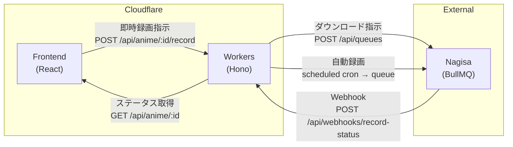
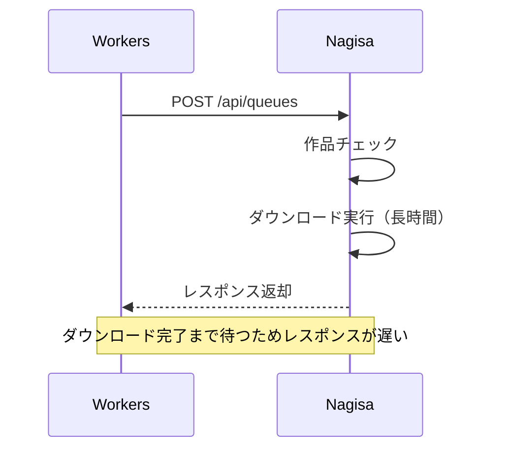
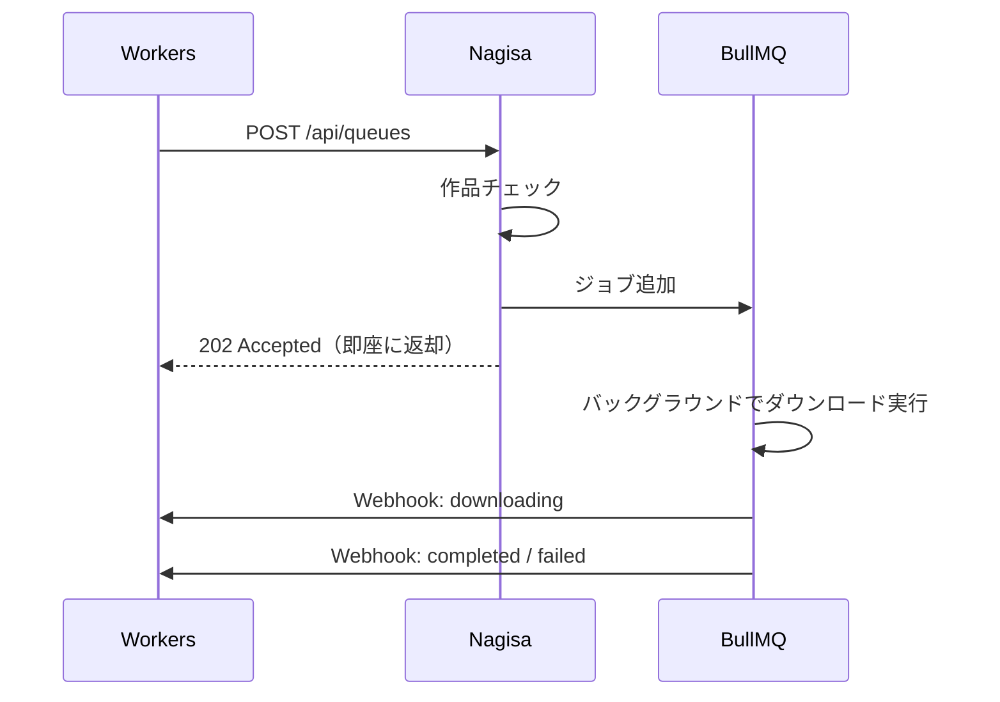
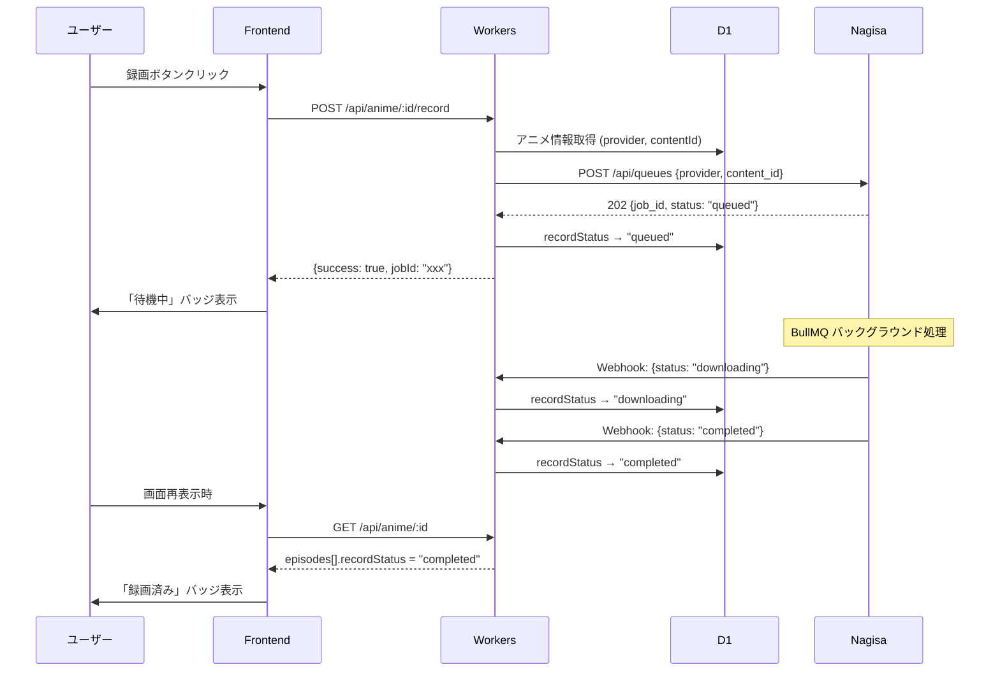
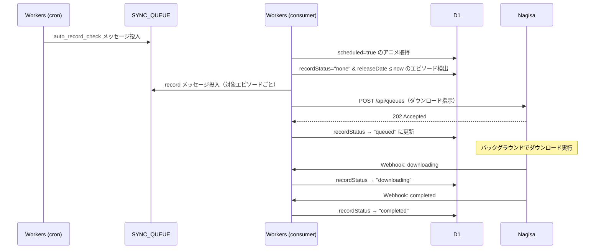
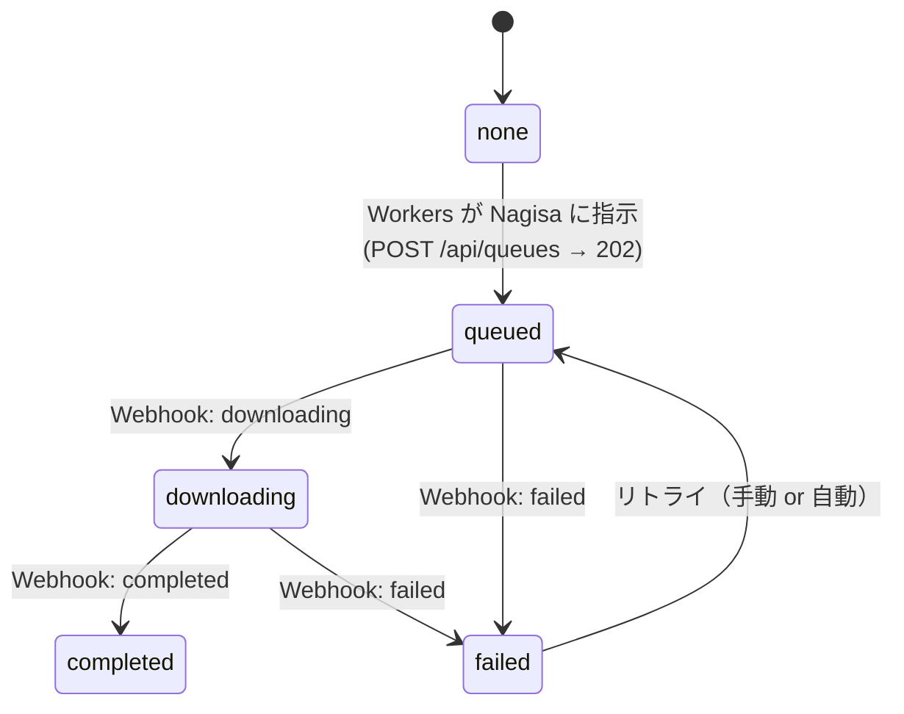
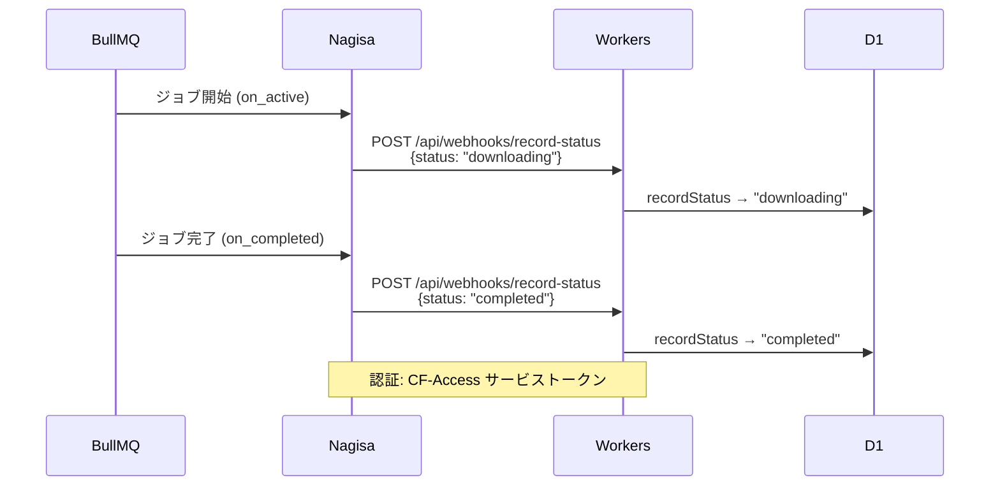

# 録画機能設計: 自動録画 & 即時録画

## 概要

録画機能を **即時録画**（配信済みエピソードの手動ダウンロード）と **自動録画**（録画予約した作品の新規エピソードを定期的にダウンロード）の 2 つに分類し、それぞれの設計・責務分担・工数を定義する。

## 用語

| 用語 | 意味 |
|------|------|
| Nagisa | 外部バックエンド。BullMQ を使いダウンロードジョブを実行する |
| Workers | Cloudflare Workers 上の Hono API（本リポジトリ） |
| 即時録画 | ユーザー操作で既存エピソードのダウンロードを指示する |
| 自動録画 | `scheduled: true` の作品について、未録画の新規エピソードを自動でダウンロードする |

## 設計原則

**Nagisa はバックエンドの中のバックエンド（実行層）であり、能動的にデータを取りに行かない。**

- Nagisa はダウンロード実行に特化する。何をダウンロードすべきかの判断は Workers 側が行う
- Workers → Nagisa は常に POST（指示を送る）方向
- Nagisa → Workers へのポーリングは行わない
- Nagisa → Workers への POST は「完了/失敗の報告（Webhook）」のみ許可する。これはポーリングではなくイベント通知であり、設計原則に反しない
- Workers の `scheduled` トリガーが起点となり、判断 → 指示の流れを作る



---

## 1. 即時録画（配信済みエピソードの手動ダウンロード）

### 現状の問題

現在の `POST /api/anime/:id/record` は Nagisa へリクエストを送り、**Nagisa がリクエストを処理し終わるまで応答を待つ**ため、レスポンスが遅い。

### 改善方針

Nagisa 側を変更し、リクエストの受付確認（作品の存在チェック + キュー投入）が完了した時点で即座にレスポンスを返す。実際のダウンロード処理は BullMQ のバックグラウンドジョブとして非同期実行する。

### Nagisa 側の変更

#### 現状の挙動（推定）



#### 改善後の挙動



#### レスポンス仕様

```json
// 成功（ジョブをキューに投入した）
HTTP 202 Accepted
{
  "job_id": "xxx",
  "status": "queued"
}

// 作品が見つからない
HTTP 404 Not Found
{
  "error": "Content not found",
  "content_id": "xxx"
}
```

### Workers 側の変更

`POST /api/anime/:id/record` のレスポンスハンドリングを更新する。

#### 現状

```typescript
// Nagisa の応答をそのまま成否判定
if (!res.ok) return c.json({ error: ... }, 502)
return c.json({ success: true }, 200)
```

#### 改善後

```typescript
// 202 Accepted で即座にレスポンス
if (!res.ok) return c.json({ error: ... }, 502)
const body = await res.json()
return c.json({ success: true, jobId: body.job_id }, 200)
```

### 即時録画の全体フロー



### エピソード単位での録画指示

現在は `content_id`（作品単位）で録画指示を送っているが、将来的にはエピソード単位での指示も必要になる。

#### 新規エンドポイント: `POST /api/anime/:id/record/episodes`

```typescript
// リクエストボディ
{
  episodeIds: string[]  // DB上のエピソードID
}

// Workers → Nagisa へ送信するペイロード
{
  provider: "hulu" | "amazon",
  content_id: string,
  episode_ids: string[]  // プロバイダ側のエピソードID（episodeId カラム）
}
```

### 即時録画の工数

| タスク | 対象 | 工数 |
|--------|------|------|
| キュー投入後に即座にレスポンスを返す改修 | Nagisa | 0.5 日 |
| `POST /api/queues` のレスポンス形式変更 | Nagisa | ↑に含む |
| `POST /:id/record` のレスポンスハンドリング更新 | Workers | 0.25 日 |
| エピソード単位録画 `POST /:id/record/episodes` 追加 | Workers | 0.5 日 |
| エピソード単位のダウンロード受付 | Nagisa | 0.5 日 |
| フロントエンド: エピソード選択 → 録画指示 UI | Frontend | 0.5 日 |
| **小計** | | **約 2.25 日** |

---

## 2. 自動録画（録画予約した作品の新規エピソード自動ダウンロード）

### 概要

`scheduled: true` が設定されたアニメについて、未録画（`recorded: false`）の配信済みエピソードを検出し、自動で Nagisa にダウンロード指示を送る。

### データフロー



### なぜ scheduled cron → Workers → Nagisa の方向か

| 方式 | 評価 | 理由 |
|------|------|------|
| **Workers → Nagisa (POST)（採用）** | 最適 | Workers が「何をダウンロードすべきか」を DB から判断し、Nagisa に指示。Nagisa は実行に専念 |
| Nagisa → Workers (GET) ポーリング | 不適切 | Nagisa が Workers の API を呼ぶのは依存方向が逆。Nagisa は DB を持たず判断材料がない |
| Workers の scheduled から直接 Nagisa | 検討可 | 可能だが、Workers の cron 内で HTTP 外部呼び出しが増えると CPU 時間制限に当たるリスク。キュー経由が安全 |

### キューメッセージ設計

既存の `Message` 型に `record` タイプを追加する。

```typescript
// message.dto.ts に追加

const RecordMessageBodySchema = z.object({
  provider: ProviderTypeEnum,
  contentId: z.string().nonempty(),
  episodeIds: z.array(z.string().nonempty()),  // プロバイダ側の episodeId
  dbEpisodeIds: z.array(z.string().nonempty()) // DB側のID（recorded更新用）
})

export const RecordMessageSchema = z.object({
  type: z.literal('record'),
  message: RecordMessageBodySchema
})
```

### scheduled.ts の変更

新しい cron スケジュールを追加し、自動録画チェックを行う。

```typescript
// 新規 cron: 毎時30分（既存の毎時0分と重ならないようにする）
case '30 */1 * * *':
  await env.SYNC_QUEUE.send({ type: 'auto_record_check' })
  break
```

ただし、auto_record_check は DB を参照して対象エピソードを特定する必要がある。この処理はキューコンシューマで行う。

### queue.ts の変更

```typescript
case 'auto_record_check': {
  // 1. scheduled=true の全アニメを取得
  // 2. 各アニメの未録画 & 配信済みエピソードを検出
  // 3. 対象エピソードごとに record メッセージをキューに投入
  break
}

case 'record': {
  // 1. Nagisa に POST /api/queues でダウンロード指示
  // 2. Nagisa が 202 を返したら、DB の episodes.recorded を true に更新
  //    （ダウンロード完了ではなく「指示済み」の意味）
  // 3. 失敗したら retry に任せる
  break
}
```

### 録画状態の見直し

現在 `Episode.recorded` は boolean だが、ダウンロードのステータスを追跡するため enum に変更する。

| 状態 | 意味 |
|------|------|
| `none` | 未録画 |
| `queued` | Nagisa にダウンロード指示済み（BullMQ のキューに入った） |
| `downloading` | ダウンロード中（Nagisa がジョブを処理開始した） |
| `completed` | ダウンロード完了 |
| `failed` | ダウンロード失敗 |

#### 状態遷移図



#### DB マイグレーション

`Episode.recorded` (boolean) → `Episode.recordStatus` (string, default `"none"`) に変更する。

```prisma
model Episode {
  // recorded  Boolean  @default(false)  ← 削除
  recordStatus  String  @default("none") @map("record_status")
  // "none" | "queued" | "downloading" | "completed" | "failed"
}
```

既存データの移行: `recorded = true` → `recordStatus = "completed"`、`recorded = false` → `recordStatus = "none"`

#### Zod スキーマ

```typescript
export const RecordStatusEnum = z.enum(["none", "queued", "downloading", "completed", "failed"])
```

### Nagisa 側に必要な機能

| タスク | 説明 |
|--------|------|
| エピソード指定のダウンロード対応 | `episode_ids` パラメータを受け取り、指定エピソードのみダウンロード |
| 即座にレスポンスを返す（即時録画と共通） | 上記「即時録画」の改善と同じ |
| Webhook 送信（後述セクション 3 参照） | ジョブのステータス変化時に Workers へ通知する |

### 自動録画の工数

| タスク | 対象 | 工数 |
|--------|------|------|
| `record` メッセージ型の追加 | Workers | 0.25 日 |
| `auto_record_check` のキューハンドラ実装 | Workers | 0.75 日 |
| `record` のキューハンドラ実装（Nagisa 呼び出し + DB 更新） | Workers | 0.5 日 |
| `scheduled.ts` に自動録画 cron 追加 | Workers | 0.25 日 |
| エピソード指定ダウンロード対応 | Nagisa | 0.5 日 |
| テスト・動作確認 | 全体 | 0.5 日 |
| **小計** | | **約 2.75 日** |

---

## 3. Webhook による完了通知（Nagisa → Workers）

### 概要

Nagisa の BullMQ ジョブのステータスが変化したタイミングで、Workers のエンドポイントに Webhook を送信し、DB のエピソード録画ステータスを更新する。

### なぜ Webhook か

| 方式 | 評価 | 理由 |
|------|------|------|
| **Webhook（採用）** | 最適 | リアルタイム、Nagisa 側は POST 1 回送るだけ、Workers 側は受け口を 1 つ追加するだけ |
| Workers → Nagisa ポーリング | 不適切 | Workers の cron で Nagisa に定期的に状態を聞くのは負荷が大きく、設計原則に反する |
| 共有ストレージ (KV/R2) | 過剰 | Nagisa に Cloudflare の認証が必要になり複雑。この用途には大げさ |

### データフロー



#### リクエスト仕様

```json
POST /api/webhooks/record-status
Headers: { "CF-Access-Client-Id": "<ID>", "CF-Access-Client-Secret": "<SECRET>" }
Body: {
  "provider": "hulu" | "amazon",
  "content_id": "xxx",
  "episode_ids": ["ep1", "ep2"],
  "status": "downloading" | "completed" | "failed",
  "error": "エラー詳細（failed時のみ）"
}
```

### Workers 側: Webhook 受信エンドポイント

`src/routes/webhooks.ts` を新規作成する。

```typescript
// POST /api/webhooks/record-status
// 認証は CF-Access が Workers の前段で行うため、コード内での検証は不要
webhooks.post("/record-status", async (c) => {
  // 1. リクエストボディをパース
  const { provider, content_id, episode_ids, status, error } = body

  // 2. episode_ids (プロバイダ側ID) → DB の Episode を特定して recordStatus を更新
  await prisma.episode.updateMany({
    where: {
      episodeId: { in: episode_ids },
      season: { anime: { provider, contentId: content_id } }
    },
    data: { recordStatus: status }
  })

  return c.json({ success: true }, 200)
})
```

### Nagisa 側: Webhook 送信

BullMQ のイベントリスナーでジョブのステータス変化を検知し、Workers に POST する。

```python
# BullMQ ジョブのイベントハンドラ

# ジョブ開始時
def on_active(job):
    send_webhook(job, "downloading")

# ジョブ完了時
def on_completed(job):
    send_webhook(job, "completed")

# ジョブ失敗時
def on_failed(job, error):
    send_webhook(job, "failed", error=str(error))

def send_webhook(job, status, error=None):
    requests.post(
        f"{WORKERS_URL}/api/webhooks/record-status",
        headers={
            "CF-Access-Client-Id": CF_ACCESS_CLIENT_ID,
            "CF-Access-Client-Secret": CF_ACCESS_CLIENT_SECRET,
        },
        json={
            "provider": job.data["provider"],
            "content_id": job.data["content_id"],
            "episode_ids": job.data.get("episode_ids", []),
            "status": status,
            "error": error,
        },
    )
```

### 認証

双方向とも **Cloudflare Access サービストークン**で認証する。

- Workers → Nagisa: 既存の CF-Access サービストークン（設定済み）
- Nagisa → Workers: Nagisa 用の CF-Access サービストークンを新規発行し、Workers 側の CF-Access ポリシーで許可する

Workers 側で独自の認証コードを書く必要がない（CF-Access が前段で検証する）。認証情報の管理も Cloudflare ダッシュボードに集約される。

### Webhook の工数

| タスク | 対象 | 工数 |
|--------|------|------|
| `POST /api/webhooks/record-status` エンドポイント追加 | Workers | 0.5 日 |
| CF-Access ポリシー設定（Nagisa 用サービストークン発行） | Infra | ↑に含む |
| `Episode.recordStatus` への DB マイグレーション | Workers | 0.25 日 |
| BullMQ イベントリスナーで Webhook 送信 | Nagisa | 0.5 日 |
| **小計** | | **約 1.25 日** |

---

## 4. フロントエンド: 録画ステータス表示

ダウンロードの進捗率（%）は不要だが、現在のステータスはユーザーに表示する。

### 表示仕様

| ステータス | 表示 |
|-----------|------|
| `none` | 表示なし（録画ボタンを表示） |
| `queued` | Badge: 「待機中」（グレー、パルスアニメーション） |
| `downloading` | Badge: 「ダウンロード中」（ブルー、パルスアニメーション） |
| `completed` | Badge: 「録画済み」（グリーン） |
| `failed` | Badge: 「失敗」（レッド） + リトライボタン |

### 実装箇所

- アニメ詳細ページ（`src/app/routes/anime/$id/index.tsx`）: エピソード一覧の各行にステータスバッジ
- 一覧ページ: アニメカードに集約ステータス（例: 「3/12 録画済み」「2 ダウンロード中」）

### データ取得

既存の `GET /api/anime/:id` のレスポンスにエピソードの `recordStatus` が含まれるため、追加の API は不要。ステータスの更新は画面遷移時またはフォーカス復帰時の再フェッチで反映する（ポーリング不要）。

### 工数

| タスク | 対象 | 工数 |
|--------|------|------|
| ステータスバッジコンポーネント | Frontend | 0.25 日 |
| エピソード一覧への組み込み | Frontend | 0.25 日 |
| 一覧ページの集約表示 | Frontend | 0.25 日 |
| **小計** | | **約 0.75 日** |

---

## 5. 工数まとめ

| 機能 | Nagisa | Workers | Frontend | 合計 |
|------|--------|---------|----------|------|
| 即時録画の応答速度改善 | 0.5 日 | 0.25 日 | — | 0.75 日 |
| エピソード単位の録画指示 | 0.5 日 | 0.5 日 | 0.5 日 | 1.5 日 |
| 自動録画（cron + キュー） | — | 1.75 日 | — | 1.75 日 |
| Webhook 完了通知 + ステータス管理 | 0.5 日 | 0.75 日 | — | 1.25 日 |
| ステータス表示 UI | — | — | 0.75 日 | 0.75 日 |
| テスト・動作確認 | — | — | — | 0.5 日 |
| **合計** | **1.5 日** | **3.25 日** | **1.25 日** | **約 6.5 日** |

---

## 6. 実装順序

依存関係を考慮した推奨実装順:

```mermaid
gantt
  title 実装フェーズ
  dateFormat X
  axisFormat %s

  section Phase A 基盤
    Workers: DB マイグレーション (recordStatus)  :a1, 0, 1
    Nagisa: POST /api/queues 非同期化            :a2, 0, 2
    Workers: レスポンスハンドリング更新           :a3, after a1, 1

  section Phase B Webhook
    Workers: Webhook 受信エンドポイント           :b1, after a3, 2
    Nagisa: BullMQ Webhook 送信                  :b2, after a2, 2

  section Phase C エピソード録画
    Nagisa: episode_ids 対応                     :c1, after b2, 2
    Workers: POST /:id/record/episodes           :c2, after b1, 2
    Frontend: エピソード選択UI + バッジ           :c3, after c2, 2

  section Phase D 自動録画
    Workers: record メッセージ型追加              :d1, after c2, 1
    Workers: auto_record_check ハンドラ          :d2, after d1, 2
    Workers: record ハンドラ                     :d3, after d2, 2
    Workers: cron 追加                           :d4, after d3, 1
```



| Phase | 内容 | タスク |
|-------|------|--------|
| **A** | 基盤 | 1. Workers: `Episode.recordStatus` への DB マイグレーション |
| | | 2. Nagisa: `POST /api/queues` を非同期化（キュー投入後に 202 返却） |
| | | 3. Workers: レスポンスハンドリング更新 + recordStatus を queued に更新 |
| **B** | Webhook | 4. Workers: `POST /api/webhooks/record-status` エンドポイント追加 |
| | | 5. Nagisa: BullMQ イベントリスナーで Webhook 送信 |
| **C** | エピソード録画 | 6. Nagisa: `episode_ids` パラメータ対応 |
| | | 7. Workers: `POST /:id/record/episodes` エンドポイント追加 |
| | | 8. Frontend: エピソード選択 UI + ステータスバッジ表示 |
| **D** | 自動録画 | 9. Workers: `record` メッセージ型追加 |
| | | 10. Workers: `auto_record_check` ハンドラ実装 |
| | | 11. Workers: `record` ハンドラ実装（Nagisa 呼び出し） |
| | | 12. Workers: `scheduled.ts` + `wrangler.toml` に cron 追加 |

---

## 7. 将来の検討事項

- **リトライ戦略**: Nagisa への指示が失敗した場合のリトライは Cloudflare Queues の `max_retries` に任せる（現在 3 回）。Webhook で `failed` を受け取った場合の自動リトライは Phase D 以降で検討
- **重複指示の防止**: 同じエピソードに対して複数回 record メッセージが送られないよう、`auto_record_check` で `recordStatus = "none"` のみを対象にする
- **レート制限**: 大量のエピソードを一度に Nagisa に送ると負荷がかかるため、バッチサイズを制限する（キューの `max_batch_size: 5` が自然な制限になる）
- **ダウンロード進捗率**: 現時点ではステータス（待機/ダウンロード中/完了/失敗）のみ。進捗率（%）が必要になった場合は [download-progress.md](download-progress.md) を参照

関連計画: [notification-recording-integrity-plan.md](notification-recording-integrity-plan.md) を参照（自動録画のミニマル実装案と、新規エピソード検知・Discord通知との連携方針）。
