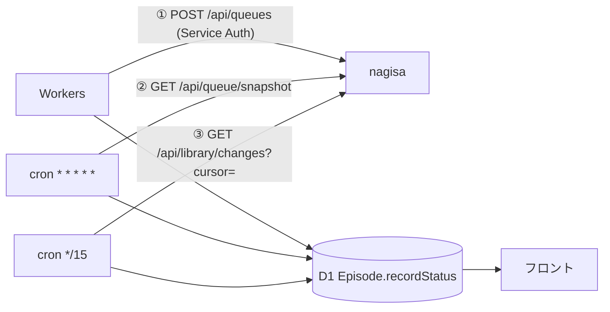

# 録画ステータス同期（Workers 側設計）

## このドキュメントについて

anime-tracker (Cloudflare Workers) が、録画バックエンド **nagisa** で実際に録画が成功したかを
確実に知るための同期設計。nagisa 側に要求する API は
`docs/features/nagisa-library-api.md` に分離した。

> **方針転換 (2026-09-23)**: 当初は nagisa → Workers の webhook を即時層として使う前提だったが、
> **webhook は廃止し、Workers → nagisa の pull 一方向に統一する**。理由は §2-0 と §10。
> `docs/features/download-status-webhook.md` および
> `docs/features/nagisa-recording-integration.md` の Phase B は**この設計で無効化される**。
> `docs/features/download-progress.md`（3秒ポーリング案）もこの設計で置き換える。

---

## 1. なぜ今の仕組みでは分からないのか

### 1-1. 状態を書く場所が無い

D1 には `Episode.recorded Boolean` と `Anime.scheduled|recorded Boolean` の3つしかない。
「キュー待ち」「DL 中」「失敗した・理由はこれ」を保存するカラムが存在しないため、
フロントは2値バッジ以上のものを表示できない。

### 1-2. webhook は本番で一度も送信されていない（確定）

本番 nagisa コンテナの `printenv` を確認した結果、
`TRACKER_URL` / `CF_ACCESS_CLIENT_ID` / `CF_ACCESS_CLIENT_SECRET` が
**3つとも存在しない**（`compose.yaml` にも定義が無い）。

`nagisa/server/webhook.py` の `send_webhook()` は冒頭で

```python
if not webhook_enabled():
    return
```

と**ログすら出さずに return** する。つまり実装は完成しているのに、
起動以来 1 件も送信されていない。§1-4 の実測値はこれで完全に説明がつく。

### 1-3. webhook は構造的に取りこぼす

仮に環境変数を入れても、以下は通知が来ない／消える。

| ケース | 挙動 |
|---|---|
| 送信失敗（Workers が 5xx / ネットワーク断） | リトライせず WARNING ログのみ |
| 既にディスク上に在り重複スキップされた話 | `ok += 1; continue` で webhook を一切送らない |
| ジョブ自体の失敗（`worker.py` の `except`） | エピソード単位の失敗しか送らないため無通知 |
| dry-run | 送らない |
| 環境変数の設定漏れ | **無言で無効化**（今回これが起きた） |

つまり **webhook は真実源になり得ない**。ドキュメント自身が
"treat missing webhooks gracefully (e.g. poll or show stale status)" と書いている。

### 1-4. 実データによる裏付け

staging の D1（ローカル写し）実測:

```
episodes.recorded = 1  →      1 件
episodes.recorded = 0 → 260,327 件
anime (scheduled, recorded) = (0,1): 43 件 / (1,1): 13 件
```

作品レベルで 56 件 `recorded` が立っているのに話レベルは 1 件。
しかも `recorded` は `PATCH /api/recordings/...`（`src/routes/recordings.ts`）から手動でも立つ。
**webhook 由来で記録された成功はゼロ**である。

---

## 2. 設計方針：pull 一方向に統一する

### 2-0. なぜ webhook を捨てるのか

Workers → nagisa は既に **Cloudflare Access の service token（Service Auth）** で繋がっている。
webhook を使うと、この逆向きにもう一組——
nagisa 用の service token 発行 + Workers 側 Access アプリのポリシー——が必要になる。
**同じ2者間の通信のために認証インフラを二重に持つことになる。**

しかも逆向きは、

- Workers 側の Access ポリシー漏れ → 全 webhook が 403
- nagisa 側の環境変数漏れ → 全 webhook が無言で消える（§1-2）

という、**どちらも無言で失敗してエラーが表に出ない**経路を2つ増やす。
実際に後者が起きて 260,328 件中 1 件という結果になった。

一方 pull には、

- 認証は既存の一方向だけ。新規の token もポリシーも不要
- 失敗すれば Workers 側の fetch がエラーを返すので `SyncRun` ログに必ず残る
- §1-3 の取りこぼし（スキップ・ジョブレベル失敗・送信失敗）が**構造的に発生しない**

という利点がある。録画は 1 話あたり数分〜数十分かかる処理なので、
cron の最小粒度（1 分）で即時性は十分に足りる。

### 2-1. 3つの層

| 層 | 手段 | 役割 | 信頼度 | 遅延 |
|---|---|---|---|---|
| ① 指示 | Workers 自身が `POST /api/queues` の応答を記録 | `pending` の起点・job_id の確保 | 確実 | 即時 |
| ② ジョブ | nagisa `GET /api/queue/snapshot` を cron で取得 | `downloading` / `failed` / stale 検出 | 中 | 1 分 |
| ③ 実体 | nagisa の録画台帳の**変更ログをカーソルで読み進める** | **録画できたかの確定** | 高 | 15 分 |



矢印は**すべて Workers → nagisa**。nagisa から Workers を呼ぶ経路は存在しない。

**③が最終権威**。①と②は③が追いつくまでの暫定表示にすぎない。
①②③が食い違ったら常に③を採用する。

---

## 3. スキーマ変更

### 3-1. Episode

```prisma
model Episode {
  // ... 既存フィールド ...
  recorded       Boolean   @default(false)   // 後方互換のため当面維持（recordStatus の写像）

  recordStatus   String    @default("none")  @map("record_status")
  // none | pending | downloading | completed | failed | stale | missing
  recordSource   String?   @map("record_source")   // queue | snapshot | reconcile | manual
  recordJobId    String?   @map("record_job_id")   // BullMQ job id（①で確保）
  recordingId    String?   @map("recording_id")    // nagisa 台帳の recording_id（③の delete 適用に必須）
  recordError    String?   @map("record_error")    // "MPD_NOT_FOUND: no playable manifest"
  recordPath     String?   @map("record_path")     // nagisa 上の相対パス
  recordSizeMb   Int?      @map("record_size_mb")  // バイトだと 2GB で Int が溢れるため MB
  recordedAt     DateTime? @map("recorded_at")     // 完了時刻（③で確定した時刻）
  recordSyncedAt DateTime? @map("record_synced_at")// 最後に状態が更新された時刻

  @@index([episodeId])       // ★ reconcile の突合に必須（現状インデックス無し）
  @@index([recordStatus])
  @@index([recordJobId])     // ② snapshot との突合用
  @@index([recordingId])     // ③ delete イベント（tombstone）の適用用
}
```

> `@@index([episodeId])` は現状存在しない。26 万件に対して毎回フルスキャンが走るため、
> 他の変更を入れなくてもこれ単体で追加する価値がある。

### 3-2. Anime

`scheduled` は現状消費側ロジックが無い死にフラグ
（`notification-recording-integrity-plan.md` §2 参照）。今回は触らず維持する。

**`Anime` には録画同期用のカラムを足さない。** 以前の設計では
作品単位の `libraryChecksum` を持って「変わった作品を特定する」つもりだったが、
変更ログ方式ではどのエピソードが変わったかを nagisa が直接教えてくれるので、
Workers 側で作品ごとの指紋を持つ理由が無くなった。

checksum を捨てるのは手間の問題だけではない。`season:episode:size` のような指紋は
**同じサイズでの差し替え**（再エンコード・別音声トラック）や `path` / `episode_id` の
訂正を検出できない。指紋で殴るのをやめて nagisa が出したイベントをそのまま適用する。

### 3-3. SyncState

差分取得のカーソルを置く場所。`key = 'library'` の 1 行しか使わないが、
後で `key = 'queue'` などを足せるように汎用の形にしておく。

```prisma
model SyncState {
  key             String    @id                            // 'library'
  libraryCursor   String?   @map("library_cursor")         // nagisa の不透明トークン (epoch+seq)
  lastSucceededAt DateTime? @map("last_succeeded_at")      // 最後に 1 ページでも適用できた時刻
  updatedAt       DateTime  @updatedAt @map("updated_at")

  @@map("sync_state")
}
```

| カラム | 使い道 |
|---|---|
| `libraryCursor` | `GET /api/library/changes?cursor=` にそのまま渡す。**中身を解釈しない**（`epoch` と `seq` が入っているのは nagisa の実装詳細） |
| `lastSucceededAt` | 「同期が止まっている」ことの検出用。`410` / `409` の連発や nagisa 停止を画面と `SyncRun` に出す |

> **カーソルを Workers 側でパースしない。** `epoch` を読んで自前で判断したくなるが、
> 失効の判定は nagisa が `410` / `409` で返す契約（`nagisa-library-api.md` R2-1）であり、
> Workers はそれに従うだけにする。両側で判定を持つと必ずずれる。

> `libraryEtag` / `libraryGeneration` / `libraryCheckedAt` は**作らない**。
> 時刻カーソル（`?since=`）は原理的に取りこぼす — nagisa が行を読んでから
> レスポンスの時刻を決めるまでの間にコミットされた変更は、
> そのページにもその時刻以降のページにも入らないためである。

### 3-4. マイグレーション

1. カラム追加（全て nullable / default 付きなのでバックフィル不要）
2. 既存 `recorded = true` を `recordStatus = 'completed'`, `recordSource = 'manual'` へ写す
3. `recorded` は当面 `recordStatus` から導出して書き続ける（フロント移行が終わったら落とす）

手順は `.claude/skills/prisma-d1.md` に従う。
D1 では列削除が RedefineTables を誘発するため、**この段階では1列も削除しない**。

---

## 4. 状態機械

```
none ──(① 録画指示 202 受領)──→ pending ──(② snapshot で active)──→ downloading
                                   │                                    │
                                   │                                    │
                                   ├──(② snapshot の failed に出現)──────┴─→ failed
                                   │
                                   └──(② snapshot のどこにも居ない / 30分無音)──→ stale

任意の状態 ──(③ upsert イベント = ファイル実在)──→ completed
completed  ──(③ delete イベント = tombstone)──→ missing
failed / stale / missing ──(再指示)──→ pending
```

**`completed` を書けるのは ③ だけ**。②の「ジョブがキューから消えた」は成功を意味しない
（スキップ・途中失敗・ワーカー再起動と区別できない）。

### 遷移の優先順位

| 由来 | 優先度 | 備考 |
|---|---|---|
| ③ reconcile | 最高 | ファイルの実在が全てに勝つ |
| ② snapshot | 中 | `downloading` / `failed` / `stale` のみ書く |
| ① 指示 | 中 | `pending` と `recordJobId` の起点 |
| manual (PATCH) | 低 | ユーザーの明示操作。次の reconcile で上書きされ得る |

### stale の判定

`recordStatus in ('pending','downloading')` かつ以下の両方:

- ② snapshot の active / wait / delayed / failed のどこにも該当ジョブが存在しない
- `recordSyncedAt` が 30 分より古い

②の取得に失敗した回は**何も書かない**（後述）。

---

## 5. ① 録画指示時の自己記録

`POST /api/queues` は 202 で `{job_id, status:"queued"}` を返す（Phase A で実装済み）。
Workers はこの応答を受けた時点で、自分が指示した話を `pending` に落とす。
**nagisa からの通知を待たない**のがこの設計の起点。

```typescript
const res = await fetchNagisa('/api/queues', {
  method: 'POST',
  body: { provider, content_id: contentId, episode_ids: episodeIds }
})   // → { job_id, status: 'queued' }

await prisma.episode.updateMany({
  where: { id: { in: targetIds } },
  data: {
    recordStatus: 'pending',
    recordSource: 'queue',
    recordJobId: res.job_id,
    recordError: null,
    recordSyncedAt: new Date()
  }
})
```

- 202 以外（404 / 5xx）なら D1 は一切触らず、そのままユーザーにエラーを返す
- `recordJobId` を持つことで②の突合が `episode_id` の表記揺れに依存しなくなる

### 5-1. 実装時に足した判断（`src/lib/record-intent.ts`）

対象は**リクエストではなく nagisa のレスポンス**（正規化後の `data.seasons`）から決める。
その上で、素朴に書くと壊れる箇所が 3 つあった。

**`completed` は上書きしない。** 既に実体がある話を `pending` に落とすと録画済みが消える。
nagisa は既存ファイルを飛ばすのでジョブは何も書かずに終わり、台帳に変更イベントが出ない
＝③が `completed` を書き戻す材料を持たないまま、②が 30 分後に `stale` へ落としてしまう。
読み出しの条件だけでなく `updateMany` の `where` にも `recordStatus: { not: 'completed' }` を置く
（読んだ後・書く前に③が `completed` を書く隙があるため）。

**上限は 3 つ、いずれも D1 の queries per invocation (1000) が理由。**

| 定数 | 値 | 何を守るか |
|---|---|---|
| `MAX_JOBS_PER_REQUEST` | 200 | クエリ数は**話数ではなくジョブ数**で決まる（読み 1 + 書き 1 / ジョブ） |
| `MAX_PENDING_PER_REQUEST` | 900 | 1 リクエストで `pending` にする行数 |
| `MAX_ROWS_PER_JOB` | 2000 | 作品 1 本を全部メモリへ載せる経路の歯止め（isolate 128MB は同時リクエストで共有） |

上限で控えきれなかった行は**録画自体を止めない**。job id を持たないので追跡対象から外れ、
実体が出来たときに③が `completed` で拾う。

**切り詰めは `unmatched` に混ぜない。** 話数の絞り込みは読み出しの**後**（メモリ上）なので、
`MAX_ROWS_PER_JOB` で切れると指定話が読み出しの外に落ちて「該当なし」に化ける。
調べる先を間違えるため `truncated` として別に数え、`record-intent-rows-truncated` で警告する。
戻り値は `{ marked, unmatched, dropped, preserved, truncated }` の 5 本。

---

## 6. ② ジョブ追従（cron `* * * * *`）

nagisa の `GET /api/queue/snapshot`（新設、仕様は nagisa 側ドキュメント §R5）から
active / wait / delayed の全件と、直近の failed を取得する。

```typescript
const snap = await fetchNagisa('/api/queue/snapshot?since=' + lastSnapshotAt)

const activeJobs  = new Set(snap.jobs.filter(j => j.state === 'active').map(j => j.job_id))
const liveJobs    = new Set(snap.jobs.filter(j => j.state !== 'failed').map(j => j.job_id))
const failedJobs  = new Map(snap.jobs.filter(j => j.state === 'failed')
                                     .map(j => [j.job_id, j.failed_reason]))

// pending → downloading
await prisma.episode.updateMany({
  where: { recordStatus: 'pending', recordJobId: { in: [...activeJobs] } },
  data: { recordStatus: 'downloading', recordSource: 'snapshot', recordSyncedAt: new Date() }
})

// → failed
for (const [jobId, reason] of failedJobs) {
  await prisma.episode.updateMany({
    where: { recordJobId: jobId, recordStatus: { in: ['pending', 'downloading'] } },
    data: {
      recordStatus: 'failed',
      recordSource: 'snapshot',
      recordError: (reason ?? '').slice(0, 500),
      recordSyncedAt: new Date()
    }
  })
}

// → stale（キューのどこにも居ない かつ 30分無音）
await prisma.episode.updateMany({
  where: {
    recordStatus: { in: ['pending', 'downloading'] },
    recordJobId: { notIn: [...liveJobs, ...failedJobs.keys()] },
    recordSyncedAt: { lt: new Date(Date.now() - 30 * 60_000) }
  },
  data: { recordStatus: 'stale', recordSource: 'snapshot', recordSyncedAt: new Date() }
})
```

- nagisa が落ちている / タイムアウトした場合は**何も書かない**（全件 stale 化の事故を防ぐ）
- `completed` はここでは絶対に書かない。ジョブがキューから消えた ≠ 成功
- snapshot は active/wait/delayed が通常数件なので、毎分叩いても nagisa 側の負荷は無視できる

### 6-1. 実装時に足した判断（`src/lib/job-sync.ts`）

上の擬似コードから、D1 の上限と「取りこぼさない」の両立のために変えた点:

- **先にローカルの追跡行を引き、キューとの交差だけを見る。** キュー側の件数で
  回すと、nagisa に失敗が数万件積まれている状態で heartbeat も検索も数百文に
  膨らみ、D1 の queries per invocation (1000) を超えて同期ごと落ちる。
  追跡行が 0 件なら nagisa を叩かずに終わる（何も録画していない時間帯の分）。
- **読み出しは `recordSyncedAt` の昇順に固定し、1 tick 900 行まで。** 並び順を
  指定しないと毎 tick ほぼ同じ先頭 900 行が返り、901 件目以降が永久に検査
  されない（キューから消えても stale にならない）。昇順なら見ていない行ほど
  先に来るので、上限で打ち切った回でも順に巡る。
- **キューに居た行は毎 tick `recordSyncedAt` を進める（heartbeat）。** これが
  無いと猶予の起点が pending → downloading の 1 回しか動かず、何時間も走った
  ジョブが消えた瞬間に「30 分無音」を満たしてしまう。failed の行も「キューに
  居る」ので heartbeat に含める（件数上限で落とし切れなかったぶんが stale に
  流れないように）。
- **stale は否定形（`notIn`）ではなく肯定形で名指しする。** `notIn` は bound
  parameter 上限 (100) を超え、分割すると「どのチャンクにも属さない」が 1 文で
  表せない。読めた行からキューに居たものを引いた差なら、上限で打ち切った回でも
  そのまま落とせる。
- **`recordSyncedAt` が NULL の追跡行には、まず起点だけ入れる。** `lt` は NULL を
  拾わないので、放っておくと永久に落ちない行になる。いきなり stale にしないのは
  「起点が無い」と「無音が続いている」が別だから。
- **lease は付けない。** この経路が書くのは自己修正的な状態だけで（次 tick が
  同じキューを見て同じ結論を出す）、二重起動しても同じ行に同じ値が入る。
  `completed` を書かないので台帳同期と競合もしない。
- **観測時刻はリクエストを出す前に取る。** 応答を読み終えた時刻を使うと、取得が
  長引いた回に「古い不在」を今の不在として扱う：12:00 のキューに居なかった行が
  12:01 に別 tick の heartbeat を受けていても、12:32 に読み終えた側の cutoff
  (12:02) がそれを追い越して stale にできてしまう。開始時刻なら cutoff は必ず
  観測時点より手前に来るので、遅れた回は「落としそこねる」側に倒れる。
- **`recordSyncedAt` は前より新しいときだけ書く。** lease が無いぶん、cron が
  重なった回（前 tick が 1 分を超えた、手動同期と衝突した）に古い観測時刻で
  上書きすると生存確認の履歴が巻き戻り、無音になっていない行が 30 分後の条件を
  満たす。heartbeat と pending → downloading の両方に条件を付ける。
- **キューが同じ `job_id` を複数返しても 1 件として数える。** 重複したままだと
  チャンク数が「追跡行 900 件」から見積もったクエリ数の上限を超える。

---

## 7. ③ reconcile（cron `*/15`・変更ログをカーソルで読み進める）

### 7-0. なぜ「変更ログ + カーソル」なのか

素朴にやるなら「nagisa の録画一覧を全部引いて D1 と突き合わせる」だが、これは採らない。

録画実体は現在 146 GB ÷ 0.5〜1.5 GB/話 ≒ **1,000〜3,000 本**で、全件でも 1 MB 以下。
今は載る。しかし**載ることと、毎回引いてよいことは別**である。ライブラリは増える一方で、
「全件引く」実装は増え続けるデータに対して 15 分ごとに線形に重くなり、
しかも壊れるのは増えきった後になる。最初から差分で読む。

時刻カーソル（`?since=`）も採らない。nagisa が行を読んでからレスポンスの時刻を決めるまでの
間にコミットされた変更は、**そのページにも次の `since` 以降のページにも入らず、永久に消える**。
作品単位の checksum も採らない（→ §3-2）。

採るのは、nagisa 側が録画台帳への変更を**不変のイベント列**として積み、
Workers がその中の位置（カーソル）を持って読み進める形（→ `nagisa-library-api.md` R1〜R3）。

| 性質 | どう効くか |
|---|---|
| イベントは追記のみ・`seq` 昇順 | 読み進めた位置さえ持てば取りこぼしが原理的に起きない |
| 変化が無ければ 0 件 | 録画が走っていない tick は D1 に 1 行も書かない |
| `delete` イベント（tombstone） | ファイル消失が差分に乗る。Workers 側の全件照合が不要になる |
| `epoch` による履歴 identity | nagisa 側の台帳が作り直されたら `410` で明示的に落ちる |

通常時のレスポンスは `{"epoch": ..., "changes": [], "next_cursor": ..., "has_more": false}` で
100 バイト程度。**日次の全件照合は無くなった**（旧 §7-2 は削除）。

### 7-1. 差分適用（15 分ごと）

```typescript
const state = await prisma.syncState.findUnique({ where: { key: 'library' } })
if (!state?.libraryCursor) return await bootstrapLibrary()   // → §7-3

let cursor = state.libraryCursor
for (let page = 0; page < MAX_PAGES_PER_RUN; page++) {
  const res = await fetchNagisaRaw(`/api/library/changes?cursor=${encodeURIComponent(cursor)}&limit=200`)

  if (res.status === 410 || res.status === 409) return await bootstrapLibrary()   // → §7-3

  const body = LibraryChangesSchema.parse(await res.json())
  cursor = await applyPage(body)          // ← 適用とカーソル保存を 1 バッチで（下記）
  if (!body.has_more) break
}
```

#### 適用とカーソル保存は同じバッチに入れる

ここが設計の肝で、**エピソードの更新を書いてからカーソルを別途 `UPDATE` すると壊れる**。
間で落ちればカーソルだけ進んで変更が失われる（逆順なら重複適用になるが、
適用は冪等なのでこちらの向きの方がまだ安全）。両方を 1 つの原子的な書き込みにする。

D1 には interactive transaction が無いので、`prisma.$transaction(tx => ...)` は使えない。
**配列形式**の `$transaction([...])`（D1 の batch にマップされる）に収まるよう、
1 ページのイベント数を `limit=200` に抑える。

```typescript
async function applyPage(body: LibraryChanges): Promise<string> {
  const writes = body.changes.map((c) =>
    c.op === 'upsert' ? upsertWrite(c) : deleteWrite(c)
  )

  await prisma.$transaction([
    ...writes,
    prisma.syncState.update({
      where: { key: 'library' },
      data: { libraryCursor: body.next_cursor, lastSucceededAt: new Date() }
    })
  ])
  return body.next_cursor
}
```

> **カーソルは「最後に適用し終えたイベント」までしか進めない。**
> 受け取った時点で `next_cursor` を保存して後から適用する、という順序にすると、
> 適用側が落ちたぶんが永久に取りこぼされる。

#### `upsert` — 録画実体の確定

```typescript
const upsertWrite = (c: UpsertChange) =>
  prisma.episode.updateMany({
    where: { episodeId: c.item.episode_id,
             season: { anime: { provider: c.item.provider, contentId: c.item.content_id } } },
    data: {
      recordStatus: 'completed',
      recordSource: 'reconcile',
      recordPath: c.item.path,
      recordSizeMb: Math.round(c.item.size / 1024 / 1024),
      recordedAt: new Date(c.item.mtime),
      recordSyncedAt: new Date(),
      recordError: null,
      recorded: true
    }
  })
```

`updateMany` なので該当 0 件でもエラーにならない。これは**意図的**で、
nagisa 側にしか無い録画（Workers が追跡していない作品、`content_id` 未解決の行）が
同期を止めてはいけない。該当 0 件だったイベントは §7-5 で件数だけ数える。

**`completed` を書けるのはこの経路だけ。** ② の snapshot が `completed` を返しても
それは「ジョブが終わった」であって「ファイルがある」ではない（P2 のスキップ分岐）。

#### `delete` — 消失の確定

```typescript
const deleteWrite = (c: DeleteChange) =>
  prisma.episode.updateMany({
    where: { recordPath: c.recording_id_path ?? undefined, recordStatus: 'completed' },
    data: { recordStatus: 'missing', recordSyncedAt: new Date(), recorded: false }
  })
```

`delete` イベントは `recording_id` しか持たないので、Workers 側は
**`upsert` を適用したときに `recording_id` を控えておく**必要がある
（`Episode.recordJobId` とは別に `recordingId` を 1 列足すか、`recordPath` を
`recording_id` から引けるようにする。実装時に決める → §9 Step 2）。

> 旧設計の「日次で全件を引き、library に無い話を `missing` にする」は使わない。
> 「応答に含まれていない」はページ切れ・引き損ねと区別できず、
> 1 作品の取得失敗で無関係の作品が丸ごと `missing` になる事故を作る。
> **消失は nagisa が明示的に出した tombstone でしか書かない。**

### 7-2. nagisa 側の消失検出に依存する部分

`delete` イベントを出すのは nagisa の日次走査（→ R1-6）である。
つまり「Jellyfin 側で手動削除した」「ボリュームが外れた」は最大 1 日遅れで反映される。
Workers 側はこれを早める手段を持たない（持つと全件走査に戻ってしまう）。

**実装した時刻は `0 3 * * *` ではなく 04:17（既定、ローカル時刻）。**
python の bullmq 2.15 に repeatable job が無いので cron 式ではなく
`nagisa/server/scheduler.py` の自前ループが刻む。`NAGISA_REINDEX_AT` で変更でき、
`off` / `none` / `disabled` / `false` / `0` / 空文字なら走査そのものを止める
（読めない値は**無効化ではなく既定にフォールバック**する。`04;17` のような打ち間違いで
台帳を見張るものが居なくなる方が悪い）。丸い時刻を避けているのは、
0 時や 3 時ちょうどに他の cron と重なると深夜のディスク I/O が団子になるため。

同じ日に 2 回走らないことは jobId で担保する: `reindex-daily-YYYY-MM-DD` を付けて
enqueue するので、再起動でループが作り直されても BullMQ 側で弾かれる。
この走査は**常に grant 無し**で積む（→ R1-6 の削除グラント）。
無人で回るものに大量削除の権限は渡さない。窓を寝過ごした場合は
遅れて発火し、id はその日のまま（翌日ぶんとして 2 回走らせない）。

代わりに **nagisa 側が走査失敗を消失と誤認しないこと**が決定的に重要になる。
マウントが外れた状態で走査すると全録画が tombstone 化し、
Workers 側は忠実にそれを適用して**全話 `missing`** にしてしまう。
R1-6 のガード（marker ファイル `.nagisa/.mounted`、削除率 10% 上限、
列挙例外の範囲を「未確認」扱い、消失判定直前の `os.stat` 再確認）は
nagisa 側の親切ではなく、この設計が成立するための前提条件である。

Workers 側でも保険を 1 枚かける: **1 run で `delete` を適用した件数が
`completed` 総数の 10% を超えたら、適用せずに中断して `SyncRun` に
`aborted: mass_delete` を記録する**。カーソルは進めない（次 run で再挑戦する）。
誤検知なら人間が気づけるし、正しい大量削除なら管理エンドポイントから解除する。

### 7-3. 初期化とカーソル失効からの復旧

`bootstrapLibrary()` が走るのは次の 3 ケース:

| きっかけ | 意味 |
|---|---|
| `SyncState.libraryCursor` が無い | 初回 |
| `410 epoch_changed` | nagisa の台帳が作り直された / 古いバックアップから復元された |
| `410 cursor_expired` | 変更ログが刈られ、Workers の位置が残っていない |
| `409 cursor_ahead` / `not_initialized` | 台帳が Workers より巻き戻っている。差分では埋められない |

```typescript
async function bootstrapLibrary() {
  let cursor: string | null = null
  let snapshotSeq: number | null = null

  do {
    const body = await fetchNagisa(`/api/library/snapshot?limit=500${cursor ? `&cursor=${cursor}` : ''}`)
    snapshotSeq = body.snapshot_seq
    await prisma.$transaction(body.items.map(upsertWriteFromItem))   // カーソルはまだ保存しない
    cursor = body.next_cursor
  } while (cursor)

  // 全ページを適用し切ってから、初めて差分カーソルを置く
  await prisma.syncState.upsert({
    where:  { key: 'library' },
    update: { libraryCursor: cursorFor(snapshotSeq), lastSucceededAt: new Date() },
    create: { key: 'library', libraryCursor: cursorFor(snapshotSeq), lastSucceededAt: new Date() }
  })
}
```

- **これは全件フェッチへの退行ではなく復旧経路**である。定常運転では走らない。
  走った回数そのものが異常の指標になるので、`SyncRun` に必ず残す
- 途中で落ちたら次 run で最初からやり直す。適用は冪等なので害は無い
- 全ページ適用が終わるまで `libraryCursor` を書かない。
  途中で差分に切り替えると未適用のぶんが取りこぼされる
- snapshot は 1,000〜3,000 件・1 MB 以下なので 500 件 × 数ページで終わる。
  `MAX_PAGES` を超えたら打ち切って次 run に継続する（カーソルは `snapshot` 側のものを
  一時テーブルではなく `SyncRun` に持たせ、`libraryCursor` とは混ぜない）
- 起動直後の nagisa に対して `409 not_initialized` が返ることがある。
  これは失敗として記録し、次 tick を待つ（snapshot を撃ち続けない）

### 7-4. D1 書き込み量

| 局面 | 1 run の書き込み |
|---|---|
| 変更なしの tick | **0 行**（`changes: []` なら `$transaction` を組まない） |
| 1 話録画された tick | 2 行（`episodes` 1 + `sync_state` 1） |
| 日次走査で 5 話消えた直後の tick | 6 行 |
| bootstrap | 録画実体の件数ぶん（現状 1,000〜3,000 行） |

差分が空のとき `sync_state` すら書かない点は意図的。`lastSucceededAt` を毎 tick 更新すると
96 回/日の無駄な書き込みが出るので、**`changes` が空でも `has_more` が false なら
`lastSucceededAt` の更新は 1 時間に 1 回だけ**に間引く。

### 7-5. Workers が知らない録画の可視化

`upsert` の適用が 0 件になるのは次のどちらかで、どちらも**隠さず件数を出す**:

| 原因 | 見せ方 |
|---|---|
| `item.content_id == null`（nagisa 側で作品を復元できなかった。R4 の reindex 由来） | `/admin/logs` に「未解決の録画 N 件」 |
| `content_id` はあるが Workers が追跡していない作品 | 同上。追跡候補として作品名を出す |

件数を `SyncRun` に記録するだけでよく、専用テーブルは作らない。
「146 GB あるのに画面には 800 話しか出ない」の原因がここに出るようにするのが目的。

### 7-6. cron の重複実行

`*/15` の run が前の run を追い越すと、同じカーソルから 2 本が読み始めて
**両方が別々にカーソルを進める**（後勝ちで取りこぼす）。

`SyncState` に lease を持たせる:

```typescript
// 取得: updatedAt が 10 分以上古い場合のみ自分のものにする
const got = await prisma.syncState.updateMany({
  where: { key: 'library', OR: [{ leaseUntil: null }, { leaseUntil: { lt: new Date() } }] },
  data:  { leaseUntil: new Date(Date.now() + 10 * 60_000), leaseOwner: runId }
})
if (got.count === 0) return   // 別の run が走っている
```

`updateMany` の `count` で取れたかどうかを判定する（D1 は単文なので条件付き更新が原子的）。
カーソル更新側の `where` にも `leaseOwner: runId` を入れて、
lease を失った run が書き戻せないようにする（fencing）。

### 7-7. 実行ログ

`notification-recording-integrity-plan.md` の確定方針に従い、各 run の結果を
`SyncRun` モデルに記録し `/admin/logs` で見られるようにする。
pull 方式では nagisa への fetch 失敗が必ず Workers 側の例外として現れるため、
**「同期が動いていないのに誰も気づかない」状態は SyncRun を見れば必ず分かる**。
これは webhook 方式では原理的に不可能だった（送信側が黙るので受信側に痕跡が残らない）。

残すもの: 適用した `upsert` / `delete` 件数、該当 0 件だったイベント数、
`bootstrap` の発動理由（`410` / `409` / 初回）、`aborted: mass_delete`、
nagisa への HTTP ステータス、lease を取れずスキップした回数。

### 7-8. 実装時に足した判断（`src/lib/library-sync/`）

- **同じエピソードを指す台帳行が複数あるときの勝者は mtime で決める**（同着は
  `recording_id` の辞書順）。録り直してパスが変わった、別シーズン表記で二重に
  登録されている、といった理由で 1 ページに 2 行来ることがある。順に書くと
  `recording_id` がページの並び任せになり、tombstone がこの id で引けなくなる。
- **snapshot の UPDATE には「今入っている録画より古ければ書かない」条件を付ける。**
  ページ内の勝者決定だけでは足りない: snapshot はページ間に順序が無いので、
  ページ 1 で書いた新しい録画をページ 2 の古い録画が上書きし、あとから古い方の
  tombstone が届くと実体があるのに `missing` に落ちる。
  条件は **厳密に新しいときだけ勝つ**（等号で通すと、同じ mtime の別録画が
  同じ事故を起こす。ページ内なら `recording_id` でタイを裁けるが、ページ間では
  裁けない）。ただし **`recording_id` が一致する行は常に通す**ので、パスや容量
  だけが変わった再走査は mtime 据え置きでも入る。
  **変更ログ側には付けない** — あちらは `seq` の順序が正しさの根拠で、
  「消して録り直した」が `delete B` → `upsert A` の順で届くため、mtime で弾くと
  upsert だけ落ちて missing に化ける。
  代わりに、**弾いた行にも「今回の台帳に居た」印（`record_synced_at`）だけは
  別の 1 文で押す**。押さないと掃き出しがその行を「台帳から消えた」と読み、
  古い録画として実在しているエピソードを `missing` に落としてしまう。
  印を押すのは掃き出しと同じ `completed` の行だけ（走行中の行の
  `record_synced_at` は job-sync の猶予とページ送りの起点なので触らない）。
- **太いページは複数トランザクションに割って流す**（カーソル更新は必ず最後の
  バッチ）。ページ単位で拒否すると、そのページ以降が永久に止まる。分割しても
  取りこぼしは出ない: カーソルは最後のバッチでしか動かず、upsert / tombstone は
  冪等なので前半の再適用は無害。
  代わりに **fencing の主張は 1 段弱くなる**: 分割後の「tail が 0 件」が言うのは
  「カーソルを進めていない」までで、「1 行も書いていない」ではない。横取りされた
  run は横取りより前のバッチを残して降りる。その前半は lease を持っていた時点の
  書き込みなので不正ではなく、新しい所有者が同じページを読み直せば上書きされる。
  それでも 1 ページ 900 文を超える回はデータ側の異常（台帳 1 行が数千の
  エピソードに解決される等）なので、1 行も書かずに `aborted: page_too_large` を
  残して降りる。
- **エピソードの書き込みにも lease 条件を raw SQL の `EXISTS` で載せる。**
  カーソル更新だけを fencing しても、横取りされた run の書き込みはコミットされて
  しまう（D1 の batch は「0 件更新だからロールバック」ができない）。同じバッチの
  最後に置いた `sync_state` の更新が 0 件なら、同じ条件を共有する全文も 0 行と
  確定できる。
- **残っている歪み（承知のうえ）**: 1 エピソードに録画が 2 本あり、勝っている方
  （新しい方）だけが nagisa 側で消されると、tombstone が `recording_id` 一致で
  刺さって `missing` になる。負けていた古い録画は実在するのに、である。次の
  snapshot でその古い行を読めば `completed` に戻るので最長 15 分の誤表示で済む。
  エピソード 1 行に録画を 1 本しか持たせていないこと自体の帰結なので、直すなら
  行を分けるしかない。

---

## 8. API / フロント

### 8-1. レスポンススキーマ

`src/schemas/recording.dto.ts`（または既存の anime.dto.ts）に追加。

```typescript
export const RecordStatus = z.enum([
  'none', 'pending', 'downloading', 'completed', 'failed', 'stale', 'missing'
])

export const EpisodeRecordState = z.object({
  status: RecordStatus,
  error: z.string().nullable(),
  path: z.string().nullable(),
  sizeMb: z.number().nullable(),
  recordedAt: z.string().datetime().nullable(),
  syncedAt: z.string().datetime().nullable()
})
```

### 8-2. 表示

| status | 表示 | 操作 |
|---|---|---|
| `none` | （バッジ無し） | 録画する |
| `pending` | 「キュー待ち」パルス | 取り消し |
| `downloading` | 「録画中」パルス | 取り消し |
| `completed` | 「録画済み」+ サイズ | 再録画 |
| `failed` | 「失敗」+ 理由 | 再試行 |
| `stale` | 「応答なし」 | 再試行 |
| `missing` | 「ファイル消失」 | 再録画 |

ボタンは状態で出し分けず常に同じ位置に置き、ラベルと意味だけ変える
（`feedback_no_conditional_hiding` の方針）。

進捗率（0-100%）は BullMQ の `job.progress` を②の snapshot 経由で取れるが、
**D1 には保存しない**。書き込み量が跳ね上がるため、進捗が要るなら
詳細画面表示中だけ `GET /api/recordings/inflight`（Workers が nagisa を都度中継）で引く。
これが実質の「即時層」であり、webhook の代わりになる。

---

## 9. 段階と工数

| Step | 対象 | 内容 | 工数 |
|---|---|---|---|
| 1 | Workers | スキーマ拡張 + `@@index([episodeId])` + ① 指示時の `pending` 記録 | 0.5日 |
| 2 | nagisa | 録画台帳 (SQLite) + 変更ログ + `GET /api/library/changes` / `/snapshot` | 1.5日 |
| 3 | Workers | ③ reconcile cron（カーソル差分）+ bootstrap + lease + SyncRun ログ | 1日 |
| 4 | nagisa | `GET /api/queue/snapshot` | 0.25日 |
| 5 | Workers | ② ジョブ追従 cron | 0.5日 |
| 6 | Workers/nagisa | webhook の撤去（§10） | 0.25日 |
| 7 | フロント | 7状態の表示 + 再試行導線 | 1日 |
| | | **合計** | **約5日** |

Step 1 と 2 は並行可能。Step 3 は 2 に依存。

**Step 1+3 だけでも「本当に録画できたか」は分かるようになる**（③が真実源のため）。
②は「録画中の表示が永久に残る」のを防ぐための補助であり、後回しにできる。

Step 1 に `Episode.recordingId`（nagisa の `recording_id` を控える列）を含める。
`delete` イベントは `recording_id` しか持たないため、これが無いと消失を適用できない（→ §7-1）。

nagisa 側が 1.5 日に増えているのは SQLite 台帳と日次走査のガード（R1-6）のぶん。
一方で webhook 方式にあった outbox / リトライ / skip 通知 /
ジョブレベル失敗通知は丸ごと不要になっている。

---

## 10. webhook の撤去

環境変数を入れて webhook を生き返らせるのではなく、**経路ごと畳む**。
中途半端に生かすと「ときどき届く不確かな入力」が増えるだけで、
真実源が③であることは変わらないため。

### Workers 側

- `src/routes/webhooks.ts` の `/api/webhooks/record-status` を削除
- `src/schemas/webhook.dto.ts` を削除（②の snapshot 用 DTO とは別物）
- Cloudflare Access 側に webhook 用のポリシーを**追加しない**（元々無い）

### nagisa 側

- `nagisa/server/webhook.py` を削除
- `tasks/common.py` の `notify_start` / `notify_complete` 呼び出しを削除
- `compose.yaml` に `TRACKER_URL` / `CF_ACCESS_*` を**追加しない**

### ドキュメント（反映済み）

- `docs/features/download-status-webhook.md` — 冒頭に廃止注記（撤去対象コードの参照用に本文は残す）
- `docs/features/nagisa-recording-integration.md` — Phase B に廃止注記
  （Phase A の非同期化と Phase C のエピソード単位指定は**引き続き有効**。
  特に Phase A の 202 に含まれる `job_id` は①②の中心になる）
- `docs/features/recording-design.md` — webhook に関する節のみ廃止、トリガー設計は有効

---

## 11. 検証環境（サイドカー）

本番の nagisa を叩かずに同期ロジックを検証するため、
nagisa リポ側に **mock モード**を用意する（詳細は nagisa 側ドキュメント §6）。

- 実ダウンロードを行わず、`POST /api/queues` を受けたら
  数秒かけて `wait → active → completed` とジョブ状態だけを進める
- `GET /api/queue/snapshot` と `GET /api/library/changes` / `/snapshot` が
  本番と同じスキーマの台帳（SQLite）を相手に動く
- 「重複スキップ（ジョブは成功するがファイルは新規に増えない）」
  「ジョブ失敗」「ファイル消失（tombstone）」をフラグで再現できるようにする
- `epoch` の振り直しと `pruned_through_seq` の前進を叩けるようにし、
  Workers 側の `410` → bootstrap 経路（§7-3）を実際に通す。
  **ここを通さずに本番へ出さない**。失効からの復旧は普段走らないぶん、
  壊れていても長期間気づけない経路になる

mock 側から Workers を呼ぶ必要が無いため、
**検証環境に Workers の URL も認証情報も渡さなくてよい**（webhook 方式との大きな差）。

Workers 側はローカル dev に向ける。dev サーバーは常時1台が立っている前提のため、
検証時は起動済みのものを使う（新たに立てない）。

---

## 12. 契約テスト（`scripts/contract/`）

サイドカー（§11）を立てるまでもなく、**nagisa の実応答が Workers の Zod DTO を
そのまま通るか**だけは常に確かめられるようにしてある。

```sh
# 採取: nagisa の Flask test client を叩いて 9 経路の JSON を落とす
uv run --project ~/nagisa python scripts/contract/capture-nagisa.py \
    ~/nagisa scripts/contract/nagisa-1.5.2.json
# 検証: 採取した JSON を src/schemas/nagisa.dto.ts で parse する
bun scripts/contract/verify-nagisa-contract.ts
```

- 台帳は SQLite なので tmp に本物を作り、pipeline と同じ `record_file` で行を入れる。
  **Redis も実際の録画ファイルも要らない**（キューは bullmq の Job / Queue の
  属性をなぞった偽物を `_QUEUE` に差し込む）
- 採取するのは `library/snapshot`（1 ページ目と続き）・`library/stats`・
  `library/changes`（差分あり／空）・カーソル無しの `409 not_initialized`・
  `/api/status`（キュー有無の両方）・`/api/queue/snapshot`
- スキーマ検査に加えて、台帳の各 item が `matchKey`（provider + content_id +
  episode_id）を作れること、`changes` が空でないことも見る。
  空の差分だけで通ると「壊れていても緑」になるため

nagisa を上げたら採り直すこと。実際、この検査で
`/api/status` の待機中ジョブが `processedOn: null` を返すのに
DTO が必須にしていた不一致（待ち行列にジョブが 1 件でも積まれると
ステータス表示全体が落ちる）が見つかっている。
